[TOC]

# 介绍

腾讯地图SDK (IOS) 是一套基于 IOS 5.1.1及以上设备的应用程序接口。通过该接口，您可以轻松访问腾讯地图服务和数据，构建功能丰富、交互性强的地图应用程序。

地图SDK：提供地图的展示、标注、绘制图形等功能。

API是提供给具有一定IOS开发经验和了解面向对象概念的开发者使用。此外，开发者应当对地图产品有一定的了解。您在使用中遇到任何问题，都可以及时向我们反馈。

地图作为一个 UI 控件，用户对地图所有接口的调用都应从主线程调用，请重点关注！！！

# 配置

## 工程配置

这里我们提供XCode的腾讯地图SDK工程配置方法。

##### 1.添加framework

3D地图需要依赖 libsqlite3.tbd、libc++.tbd、QMapKit.framework，最终 3D 地图配置截图如下：


第二步添加framework的资源文件。开发者需在[腾讯地图 iOS SDK官网](https://lbs.qq.com/ios_v1/download_3d.html)下载sdk资源包，解压后在sdk文件夹中找到QMapKit.framework文件，然后在工程界面选中  **library文件夹**  右键弹出菜单中选择"Add Files To..."，从**文件夹sdk** 中将文件QMapKit.framework添加到工程中，在弹出窗口中勾选"Copy items into destination group's folder(if needed)" 。


##### 2.添加资源文件

在工程界面右键弹出菜单中选择"Add Files To..."，从文件夹sdk（同步骤1）->QMapKit.framework中将资源文件QMapKit.bundle添加到工程中，在弹出窗口中勾选"Copy items into destination group's folder(if needed)" 。


添加需要的编译选项，在TARGETS-Build Settings-Other Linker Flags 中添加如下内容： -ObjC 。


##### 3.注意事项：

如果没有正确添加资源文件，则有可能出现地图加载不成功现象，如下图：


## 申请和设置开发密钥

##### 申请用户key

1. 访问<https://lbs.qq.com/console/key.html>,点击右上角申请秘钥,输入qq账号登录
2. 填写应用名称，描述，验证码，阅读并同意使用条款
3. 申请完成后,点击"我的秘钥"按钮,得到申请的key


##### 在项目中添加key

在使用地图SDK时，需要对应用做Key机制验证，如果地图不添加key，地图将不能运行，控制台会显示没有key的错误日志。

key的设置方法如下：

```objective-c
- (BOOL)application:(UIApplication *)application didFinishLaunchingWithOptions:(NSDictionary *)launchOptions
{
    // Override point for customization after application launch.
    [QMapServices sharedServices].APIKey = @"您的key";
    return YES;
}
```


# 地图显示

## 地图实例化

#### Hello Map

地图实例化会生成一个显示地图的视图(View)，它负责从服务端获取地图数据和捕捉屏幕触控手势事件。

在ViewController.h文件中添加QMapView

```objective-c
#import <UIKit/UIKit.h>
#import "QMapKit.h"
 
@interface ViewController:UIViewController
@property (nonatomic, strong) QMapView *mapView;
@end
```

在ViewController.m文件添加实例化QMapView的代码

```objective-c
- (void)setupMapView
{
    //初始化地图实例
  	self.mapView = [[QMapView alloc] initWithFrame:self.view.bounds];
  	//把mapView添加到view中进行显示
    [self.view addSubview:self.mapView];
}
 
#pragma mark - Life Cycle
 
-   (void)viewDidLoad
{
    [super viewDidLoad];
    // Do any additional setup after loading the view, typically from a nib.
    [self setupMapView];
}
```

运行工程，地图显示效果如下


## 设置地图类型

腾讯地图SDK（IOS）提供2中类型的基本地图，具体如下：

地图类型(mapType) ：QMapTypeStandard 代表 标准地图；QMapTypeSatellite 代表 卫星地图

##### 1、标准地图与实时路况：

标准地图的信息包括路网信息、建筑物及重要的自然景观；腾讯地图还提供了实时路况图层，可以为提供实时交通数据的城市展示实时交通状况，设置显示标准地图和实时路况的示例代码如下：

```objective-c
[self.mapView setMapType:QMapTypeStandard]; //显示标准地图
self.mapView.showsTraffic = YES; //开启实时路况
```

##### 2、卫星图：

卫星地图设置：

```objective-c
[self.mapView setMapType:QMapTypeSatellite];
```

实时路况和卫星图的效果如下所示：


##### 3、个性化地图

腾讯 iOS 3D 地图 SDK自 v4.1.1起，支持使用个性化地图模版，通过选择不同的模版可实现底图配色风格的切换。

前往选择[个性化地图模版](https://lbs.qq.com/console/customized/set/)，设定好模板后可根据地图模板ID切换个性化地图。

示例代码：

```objective-c
[self.mapView setMapStyle: (int)];	//个性化地图的ID从 1 开始，具体数量依据个人配置为准
```

# 地图手势设置

##### 1、基础操作

腾讯地图iOS SDK提供了丰富的手势操作以满足开发者对地图交互的需求，用户需要修改QMapView的相关属性进行设置：

- **QMapView.zoomEnabled** 此属性用于缩放手势的开启和关闭
- **QMapView.scrollEnabled** 此属性用于地图拖动的开启和关闭
- **QMapView.overlookingEnabled** 此属性用于地图进入3D视图的开启和关闭
- **QMapView.rotateEnabled** 此属性用于地图旋转的开启和关闭

##### 2、自定义手势：

如果您想实现地图的点击事件，需要自己向地图添加手势识别，下面是示例代码：

首先继承UIGestureRecognizerDelegate协议，并实现下列方法：

```objective-c
-(BOOL)gestureRecognizer:(UIGestureRecognizer *)gestureRecognizer shouldRecognizeSimultaneouslyWithGestureRecognizer:(UIGestureRecognizer *)otherGestureRecognizer {
    return YES;
}
//点击地图时的回调
-(void)gestureAction:(UIGestureRecognizer *)gestureRecognizer {
    CGPoint point = [gestureRecognizer locationOfTouch:0 inView:_mapView];
    NSLog(@"Tap at:%f,%f", point.x, point.y);
}
```

向地图添加点击手势：

```objective-c
//添加手势识别
UITapGestureRecognizer *gestureRecognizer = [[UITapGestureRecognizer alloc]
                                         initWithTarget:self
                                         action:@selector(gestureAction:)];
[gestureRecognizer setDelegate:self];
[_mapView addGestureRecognizer:gestureRecognizer];
```

其他的自定手势可以通过上述的逻辑方法实现。


# 地图视野

##### 地图视野变换

腾讯地图SDK(IOS)提供多种接口进行地图视野的变换 

(注：腾讯地图SDK使用的是国测局坐标系（火星坐标，GCJ-02）)

接口如下：

```objective-c
//设置中心点偏移，向右向下为增长. 单位：屏幕比例值(0.25 ~ 0.75)默认为(0.5, 0.5) 
(void) 	- setCenterOffset: 
(void) 	- setCenterOffset:animated:

//设置中心点偏移，向下为正. 单位：比例值(-0.25 ~ 0.25)默认为0 
(void) 	- setCenterOffsetY:

//设置中心点经纬度 
 (void) - setCenterCoordinate:animated:

//设置缩放级别
(void) 	- setZoomLevel:animated:

//设置旋转角度, 正角度向右转, 单位(角度)
(void) 	- setRotation:animated:

//设置overlooking, 范围 [0, 45], 单位(角度)
(void) 	- setOverlooking:animated:

//设定当前地图的region
(void) 	- setRegion:animated:
    
```

##### 设置当前地图可见范围

```objective-c
//设置当前地图可见范围的mapRect
- (void) setVisibleMapRect:		(QMapRect) 	mapRect
animated:		(BOOL) 	animated 

- (void) setVisibleMapRect:		(QMapRect) 	mapRect
edgePadding:		(UIEdgeInsets) 	insets
animated:		(BOOL) 	animated
```

效果图如下：


##### 设置当前可视的Region

```objective-c
//设置可视Region
QCoordinateRegion region = QCoordinateRegionMake(CLLocationCoordinate2DMake(39.927642, 116.559448), QCoordinateSpanMake(1, 1));
    QMapRect mapRect = QMapRectForCoordinateRegion(region);
    
    QMapPoint points[5];
    points[0].x = mapRect.origin.x;
    points[0].y = mapRect.origin.y;
    
    points[1].x = mapRect.origin.x;
    points[1].y = mapRect.origin.y + mapRect.size.height;
    
    points[2].x = mapRect.origin.x + mapRect.size.width;
    points[2].y = mapRect.origin.y + mapRect.size.height;;
    
    points[3].x = mapRect.origin.x + mapRect.size.width;;
    points[3].y = mapRect.origin.y;
    
    points[4].x = mapRect.origin.x;
    points[4].y = mapRect.origin.y;
    
    self.overlays = [NSMutableArray array];
    
    QPolygon *polygon = [[QPolygon alloc] initWithPoints:points count:5];
    [self.overlays addObject: polygon];
    [self.mapView addOverlays:self.overlays];
		//调整地图视野到可视region
    [self.mapView setRegion:region animated:YES];
```

效果图如下：


##### 地图视野变换回调

```objective-c
//地图区域即将改变时会调用此接口
(void) 	- mapView:regionWillChangeAnimated:gesture:

//地图区域改变时会调用此接口
(void) 	- mapViewRegionChange:

//地图区域改变完成后会调用此接口,如果是由手势触发，当触摸结束且地图region改变的动画结束后才会触发此回调
(void) 	- mapView:regionDidChangeAnimated:gesture:
```


# 地图点击事件回调

点击地图空白处，获取该点坐标

```objective-c
//点击地图空白处会调用此接口.
- (void) mapView:(QMapView *)mapView didTapAtCoordinate:(CLLocationCoordinate2D) 	coordinate 
{
  //获取坐标点后可对它的进行操作，如生成POI点
  QPoiInfo *poi = [QPoiInfo alloc] init];
  poi.coordinate = coordinate;
  ......
  
}
```


点击地图poi图标处，获取poi信息

```objective-c
//点击地图poi图标处会调用此接口
- (void) mapView:(QMapView *)mapView didTapPoi:(QPoiInfo *)poi
{
  	//点击poi后获取其信息
  	self.poiInfo = poi;
    NSLog(@"POI  name %@",self.poiInfo.name);
    NSLog(@"POI  coordinate %@",self.poiInfo.coordinate);
}
```


# UI设置

##### 1、指南针

可以指示地图的南北方向，默认的视图状态下不显示，此控件显示在左上角，设置方式及效果图如下所示：

```objective-c
//是否显示指南针，默认为NO
self.mapView.showsCompass = YES;
```

 

##### 2、比例尺

默认显示在左下角，也可以通过参数进行设置，设置方式和效果图如下所示：

```objective-c
//是否显示比例尺，默认为YES 
self.mapView.showsScale = YES;

// 设置地图比例尺偏移  offset	比例尺的偏移量. 如果offset为CGPointZero则为默认位置
- (void)setScaleViewOffset:(CGPoint)offset;
```


##### 3、地图Logo

腾讯地图Logo默认显示在右下角，改变Logo位置的示例代码如下：

```objective-c
//设置地图Logo位置和大小. 调用后会覆盖默认位置
[self.mapView setLogoMargin:(CGPoint) 	margin anchor:(QMapLogoAnchor) 	anchor];

anchor	Logo基于mapview的位置的基准锚点:
		QMapLogoAnchorRightBottom       		///< 右下对齐, logo的对齐位置, 默认锚点位置
    QMapLogoAnchorLeftBottom,           ///< 左下对齐
    QMapLogoAnchorLeftTop,              ///< 左上对齐
    QMapLogoAnchorRightTop,             ///< 右上对齐
    QMapLogoAnchorMax                   ///< 边界, 自身无实际意义

```


​						(注意：使用腾讯地图SDK要求显示logo，如上图所示)

改变地图Logo的大小，示例代码如下：

```objective-c
- (void) setLogoScale:(CGFloat) 	scale	
//scale	Logo大小. 基于原始大小的比例值, 默认为1.0. 有效区间[0.7, 1.3]


```

# 地图标注

## 点标注

标注可以精确表示用户需要展示的位置信息，腾讯地图提供的标注功能允许用户自定义图标和信息窗，同时提供了标注的点击、拖动事件的回调。

SDK 提供的地图标注为QPointAnnotation类，不同的标记可以根据图标和改变信息窗的样式和内容加以区分。

#### 1、添加QPointAnnotation

下面是添加QPointAnnotation的代码示例：

```objective-c
@property (nonatomic, strong) NSMutableArray<id <QAnnotation> > *annotations;
 
//点标注的View渲染
- (QAnnotationView *)mapView:(QMapView *)mapView viewForAnnotation:(id<QAnnotation>)annotation
{
    if ([annotation isKindOfClass:[QPointAnnotation class]])
    {
        static NSString *pointReuseIndetifier = @"pointReuseIndetifier";
        QPinAnnotationView *annotationView = (QPinAnnotationView*)[self.mapView dequeueReusableAnnotationViewWithIdentifier:pointReuseIndetifier];
 
        if (annotationView == nil)
        {
            annotationView = [[QPinAnnotationView alloc] initWithAnnotation:annotation reuseIdentifier:pointReuseIndetifier];
        }
 
        return annotationView;
    }
 
    return nil;
}

//设置点标注
- (void)setupAnnotations
{
    self.annotations = [NSMutableArray array];
 
    QPointAnnotation *annotation = [[QPointAnnotation alloc] init];
    annotation.coordinate = CLLocationCoordinate2DMake(39.984083,116.316515);
 
    [self.annotations addObject:annotation];
 
    annotation = [[QPointAnnotation alloc] init];
    annotation.coordinate = CLLocationCoordinate2DMake(39.884318,116.461515);
 
    [self.annotations addObject:annotation];
}
 
- (void)setupMapView
{
    self.mapView = [[QMapView alloc] initWithFrame:self.view.bounds];
 
    self.mapView.delegate = self;
 
    [self.view addSubview:self.mapView];
 
    [self setupAnnotations];
    [self.mapView addAnnotations:self.annotations];
}
```

运行工程，地图显示效果如下：


#### 2、标注的其他设置

默认的标注并不能显示气泡，在协议的回调函数mapView: viewForAnnotation:中设置对应的标注气泡和图标，代码如下：

```objective-c
- (QAnnotationView *)mapView:(QMapView *)mapView
                 viewForAnnotation:(id<QAnnotation>)annotation
{
    if ([annotation isKindOfClass:[QPointAnnotation class]]) {
        //设置复用标识
        static NSString *pointReuseIdentifier = @"pointReuseIdentifier";
        QAnnotationView *annotationView = [self.mapView dequeueReusableAnnotationViewWithIdentifier:pointReuseIdentifier];
        if (annotationView == nil) {
            annotationView = [[QAnnotationView alloc] initWithAnnotation:annotation reuseIdentifier:pointReuseIdentifier];
        }
 
        // 可拖拽.
        annotationView.draggable = YES;
        // 开启下落动画
        annotationView.animatesDrop = YES;
        //显示气泡
        [annotationView setCanShowCallout:YES];
        //设置图标
        [annotationView setImage:[UIImage imageNamed:@"greenPin.png"]];
 
        return annotationView;
    }
    return nil;
}
```

运行工程，地图显示效果如下：


#### 3、自定义annotation及callout

腾讯地图SDK提供了自定义 Annotation 的方法，调用示例如下：

```objective-c
- (QAnnotationView *)mapView:(QMapView *)mapView viewForAnnotation:(id<QAnnotation>)annotation
{
    if ([annotation isKindOfClass:[QPointAnnotation class]])
    {
        static NSString *pointReuseIndetifier = @"pointReuseIndetifier";
        QAnnotationView *annotationView = (QAnnotationView*)[self.mapView dequeueReusableAnnotationViewWithIdentifier:pointReuseIndetifier];
 
        if (annotationView == nil)
        {
            annotationView = [[QAnnotationView alloc] initWithAnnotation:annotation reuseIdentifier:pointReuseIndetifier];
        }
 
        annotationView.canShowCallout   = YES;
 
        UIImage *img = [UIImage imageNamed:@"marker"];
 
        annotationView.image = img;
        annotationView.centerOffset = CGPointMake(0, -img.size.height / 2.0);
 
        return annotationView;
    }
 
    return nil;
}
 
//自定义callout
- (UIView *)mapView:(QMapView *)mapView customCalloutForAnnotationView:(QAnnotationView *)annotationView
{
		//设置callout的View  
    return [[UIImageView alloc] initWithImage:[UIImage imageNamed:@"good"]];
}
```

运行工程，地图显示效果如下：


#### 4、缩放地图展示标注

腾讯地图SDK提供缩放地图展示相关联标注的功能，调整后适合当前地图窗口显示的地图范围，示例代码如下：

```objective-c
//相关联标注数组对象
@property (nonatomic, strong) NSMutableArray <id<QAnnotation>> *annotations;

//标注渲染
- (QAnnotationView *)mapView:(QMapView *)mapView viewForAnnotation:(id<QAnnotation>)annotation
  
//根据当前地图View的窗口大小调整传入的mapRect，返回适合当前地图窗口显示的mapRect
//调整后适合当前地图窗口显示的地图范围
-(QMapRect)mapRectThatFits:(QMapRect) mapRect containsCalloutView:(BOOL)bContainsCalloutView
annotations:		(NSArray< id< QAnnotation > > *) 	annotations
edgePadding:		(UIEdgeInsets) 	insets 
  
//设置当前地图可见范围的mapRect
- (void) setVisibleMapRect:(QMapRect) mapRect  animated:(BOOL) 	animated
```

效果图如下：


#### 5、标注属性

|           属性            |                             说明                             |
| :-----------------------: | :----------------------------------------------------------: |
|        coordinate         |                       标注view中心坐标                       |
|      reuseIdentifier      |                           复用标识                           |
|          zIndex           | z值, 决定了AnnotationView之间的压盖顺序: 值大的在上部. 默认为0. 被选中的无视zIndex会 |
|           image           |                         显示的image                          |
|       centerOffset        |              可以设置centerOffset改变view的位置              |
|       calloutOffset       |           可以设置calloutOffset改变气泡view的位置            |
|          enabled          |              默认为YES,当为NO时view忽略触摸事件              |
|         selected          |                       是否处于选中状态                       |
|      canShowCallout       |               设置是否可以显示callout,默认为NO               |
|     customCalloutView     |                        自定义callout                         |
| leftCalloutAccessoryView  |                        气泡左侧的view                        |
| rightCalloutAccessoryView |                        气泡右侧的view                        |
|         draggable         |                         是否支持拖动                         |
|         dragState         |                       当前view拖动状态                       |

#### 6、标注和气泡的接口

```objective-c
//当mapView新添加annotation views时，调用此接口
- (void) mapView:(QMapView *) 	mapView  
 didAddAnnotationViews: (NSArray< QAnnotationView * > *) 	views 

//当选中一个annotation view时，调用此接口
- (void) mapView:(QMapView *) 	mapView didSelectAnnotationView:(QAnnotationView *) 	view 

//当取消选中一个annotation view时，调用此接口
- (void) mapView:		(QMapView *) 	mapView
didDeselectAnnotationView:		(QAnnotationView *) 	view 
```

#### 7、移除标注

```objective-c
//移除标注
- (void) removeAnnotation:		(id< QAnnotation >) 	annotation
  
//移除一组标注
- (void) removeAnnotations:		(NSArray *) 	annotations	
```


# 图形绘制

## 折线

#### **绘制折线：**

在地图上绘制折线需要使用QPolyline类，将一系列坐标点连接起来显示在地图上，添加折线的步骤如下，修改setupMapView函数中的代码：

```objective-c
- (void)setupMapView
{
    self.mapView = [[QMapView alloc] initWithFrame:self.view.bounds];
 
    self.mapView.delegate = self;
 
    [self.view addSubview:self.mapView];
 
    [self.mapView setCenterCoordinate:CLLocationCoordinate2DMake(39.920269,116.390533)];
    [self.mapView setZoomLevel:10];
    //折线坐标
    /* Polyline. */
    CLLocationCoordinate2D polylineCoords[6];
    polylineCoords[0].latitude = 39.9442;
    polylineCoords[0].longitude = 116.324;
 
    polylineCoords[1].latitude = 39.9442;
    polylineCoords[1].longitude = 116.444;
 
    polylineCoords[2].latitude = 39.9042;
    polylineCoords[2].longitude = 116.454;
 		
    polylineCoords[3].latitude = 39.9042;
    polylineCoords[3].longitude = 116.334;
 
    polylineCoords[4].latitude = 39.8442;
    polylineCoords[4].longitude = 116.334;
 
    polylineCoords[5].latitude = 39.8442;
    polylineCoords[5].longitude = 116.434;
 
    //构造折线
    QPolyline *polyline = [QPolyline polylineWithCoordinates:polylineCoords count:6];
    //向地图添加折线
    [self.mapView addOverlay:polyline];
}
```

继续实现协议中的mapView: viewForOverlay:回调函数，设置折线属性以显示在地图上，具体代码如下：

```objective-c
- (QOverlayView *) mapView:(QMapView *)mapView viewForOverlay:(id<QOverlay>)overlay
{
    if ([overlay isKindOfClass:[QPolyline class]]) {
        QPolylineView *polylineView = [[QPolylineView alloc] initWithPolyline:overlay];
 
        [polylineView setLineWidth:10.f];
        //设置折线颜色为红色
        polylineView.strokeColor = [UIColor colorWithRed:1 green:0 blue:0 alpha:.8];
 
        return polylineView;
    }
    return nil;
}
```

运行程序，效果如下：


#### **绘制虚线：**

通过设置 lineDashPattern 调整虚线的样式，实线和虚线的线长序列(元素个数必须是偶数)，默认为nil为实线，示例代码如下：

```objective-c
- (QOverlayView *)mapView:(QMapView *)mapView viewForOverlay:(id<QOverlay>)overlay
{
    if ([overlay isKindOfClass:[QPolyline class]])
    {
        QPolylineView *polylineRender = [[QPolylineView alloc] initWithPolyline:overlay];
        polylineRender.lineWidth   = 10;
        polylineRender.strokeColor = [UIColor colorWithRed:1 green:0 blue:0 alpha:.8];
    
        //设置overlay虚线样式
        [polylineRender setLineDashPattern:[NSArray<NSNumber*> arrayWithObjects:[NSNumber numberWithInt:3],[NSNumber numberWithInt:3],[NSNumber numberWithInt:3],[NSNumber numberWithInt:3],[NSNumber numberWithInt:3],[NSNumber numberWithInt:3], nil]];
    
        return polylineRender;
    }
    return nil;
}
```

运行程序，效果图如下：


#### **自定义纹理：**

对普通折线设置自定义纹理的代码和效果如下：

```objective-c
//纹理样式
typedef NS_ENUM(NSInteger, QTextureLineDrawType) {
    QTextureLineDrawType_ColorLine = -1,        // 不使用纹理, 而且以颜色的形式绘制, 使用segmentColor中色值绘制
    QTextureLineDrawType_SliceAsBackground,     // 将图片以1像素为单位按行切片，根据下标从图片选取1像素来绘制线路样式(最大支持16像素高)
    QTextureLineDrawType_RepeatDraw,            // 重复绘制整个图片
    QTextureLineDrawType_FootPrint,             // 以足迹的形式重复绘制整个图片
};

//路径覆盖
@implementation QRouteOverlay
- (id)initWithCoordinates:(CLLocationCoordinate2D *)coordinateArray count:(NSUInteger)count arrLine:(NSArray<QSegmentStyle *> *)arrLine
{
    if (count == 0 || arrLine.count == 0) {
        return nil;
    }
    
    if (self = [super initWithCoordinates:coordinateArray count:count])
    {
        self.arrLine = [NSMutableArray array];
        [self.arrLine addObjectsFromArray:arrLine];
    }
    
    return self;
}
@end

//自定义纹理渲染
- (QOverlayView *)mapView:(QMapView *)mapView viewForOverlay:(id<QOverlay>)overlay
{
    if ([overlay isKindOfClass:[QRouteOverlay class]])
    {
        QRouteOverlay *ro = (QRouteOverlay*)overlay;
        QTexturePolylineView *polylineRender = [[QTexturePolylineView alloc] initWithPolyline:overlay];
        polylineRender.segmentStyle = ro.arrLine;
         if ([self.lines indexOfObject:overlay] == 1) {
           //重复绘制整个图片
            polylineRender.drawType = QTextureLineDrawType_RepeatDraw;
            polylineRender.styleTextureImage = [UIImage imageNamed:@"ball"];
            polylineRender.lineWidth = 15;
        } else {
            polylineRender.drawType = QTextureLineDrawType_FootPrint;
            polylineRender.lineWidth = 12;
            polylineRender.styleTextureImage = [UIImage imageNamed:@"foot.jpg"];
        }
        return polylineRender;
    }
   return nil;
}

//添加足迹路径
- (void)addFootPrint
{
    const int COUNT = 3;
    CLLocationCoordinate2D polylineCoords[COUNT];
    polylineCoords[0].latitude = 39.9442;
    polylineCoords[0].longitude = 116.01;
    
    polylineCoords[1].latitude = 39.942570;
    polylineCoords[1].longitude = 116.141769;
    
    polylineCoords[2].latitude = 39.838619;
    polylineCoords[2].longitude = 116.144;
    
    NSMutableArray* routeLineArray = [NSMutableArray array];
    for (int i = 0; i < COUNT-1; i++)
    {
        QSegmentStyle *subLine = [[QSegmentStyle alloc] init];
        subLine.startIndex = i;
        subLine.endIndex  = i+1;
        // random color.
        subLine.colorImageIndex = arc4random() % 6;
        [routeLineArray addObject:subLine];
    }
    QRouteOverlay *polyline = [[QRouteOverlay alloc] initWithCoordinates:polylineCoords count:COUNT arrLine:routeLineArray];
    [self.lines addObject:polyline];
    [self.mapView addOverlay:polyline];
}

//添加重复绘制图片路径
- (void)addRepeatDraw
{
  //与足迹路径相似
}
```

运行程序，效果图如下：


#### 设置线的分段颜色：

可通过 QSegmentStyle 中的 colorImageIndex 设置各分段的颜色，示例代码如下：

```objective-c
//路径覆盖(与自定义纹理相同)
@implementation QRouteOverlay
- (id)initWithCoordinates:(CLLocationCoordinate2D *)coordinateArray count:(NSUInteger)count arrLine:(NSArray<QSegmentStyle *> *)arrLine
{
  // ...........
}
@end
  
- (QOverlayView *)mapView:(QMapView *)mapView viewForOverlay:(id<QOverlay>)overlay
{
  	if ([overlay isKindOfClass:[QRouteOverlay class]])
    {
        QRouteOverlay *ro = (QRouteOverlay*)overlay;
        QTexturePolylineView *polylineRender = [[QTexturePolylineView alloc] initWithPolyline:overlay];
        polylineRender.segmentStyle = ro.arrLine;
        polylineRender.styleTextureImage = [UIImage imageNamed:@"colorSample"];
      	//设置箭头样式
        polylineRender.symbolImage = [UIImage imageNamed:@"arrow.png"];
        polylineRender.lineWidth = 10;
        polylineRender.drawSymbol = YES;
        polylineRender.symbolGap = 52;
       
        return polylineRender;
    }
  
    //折线类型
  		if ([overlay isKindOfClass:[QPolyline class]])
    {
        QPolyline *poly = (QPolyline*)overlay;
        QTexturePolylineView *polylineRender = [[QTexturePolylineView alloc] initWithPolyline:overlay];
        
       	
        if ([self.trafficLines indexOfObject:overlay] == 1) {
            polylineRender.lineWidth = 10;
          	// 不使用纹理, 而且以颜色的形式绘制, 使用segmentColor中色值绘制
            polylineRender.drawType = QTextureLineDrawType_ColorLine;
            polylineRender.drawSymbol = YES;
            polylineRender.symbolGap = 32;
            int count = (int)poly.pointCount;
            polylineRender.borderWidth = 2;
            NSArray *colors = @[[UIColor colorWithRed:254/255.0 green:212/255.0 blue:68/255.0 alpha:0.9],
                                [UIColor colorWithRed:244/255.0 green:75/255.0 blue:126/255.0 alpha:0.9],
                                [UIColor colorWithRed:82/255.0 green:192/255.0 blue:132/255.0 alpha:0.9]
                                ];
            NSMutableArray<QSegmentColor*>* segColors = [NSMutableArray array];
          	//	随机产生分段颜色
            for (int i = 0; i < count-1; i++) {
                QSegmentColor *style = [[QSegmentColor alloc] init];
                style.startIndex  = i;
                style.endIndex  = i+1;
                style.color = colors[arc4random()%3];
                style.borderColor = [UIColor colorWithRed:32/255.0 green:122/255.0 blue:67/255.0 alpha:0.9];
                [segColors addObject:style];
                polylineRender.segmentColor = segColors;
            }
        } else {
          //通过 colorImageIndex 定义分段颜色
            polylineRender.displayLevel = QOverlayLevelAboveLabels;
            polylineRender.lineWidth = 8;
            NSMutableArray* segStyles = [NSMutableArray array];
            int count = (int)poly.pointCount;
            for (int i = 0; i < count-1; i++) {
                QSegmentStyle *style = [[QSegmentStyle alloc] init];
                style.startIndex  = i;
                style.endIndex  = i+1;
                style.colorImageIndex = arc4random() % 5;
                [segStyles addObject:style];
            }
            polylineRender.segmentStyle = segStyles;
        }
        return polylineRender;
    }
    
    return nil;
}

//具体配置可参考官方IOS Demo
- (void)addCustomLine
- (void)addColorLine  

```

运行程序，效果图如下：


#### 路径置灰和擦除

此功能用于把行走过的路径线段置灰或者擦除，示例代码如下：

```objective-c
//路线线段数组
@property (nonatomic, strong) NSMutableArray<QPolyline *> *lines;


QTexturePolylineView *polylineView = (QTexturePolylineView *)[self.mapView viewForOverlay:self.lines.firstObject];

/**
*- (void) eraseFromStartToCurrentPoint:		(CLLocationCoordinate2D) 	coordinate
searchFrom:		(int) 	pointIndex
toColor:		(BOOL) 	clearColor 
*		coordinate	被擦除的终点坐标
*		pointIndex	终点所在子线段起点的下标
*		clearColor	yes则擦除 no则置灰(参照eraseColor)

*/

//擦除线段
    [polylineView eraseFromStartToCurrentPoint:CLLocationCoordinate2DMake(39.846874, 116.494518) searchFrom:2 toColor:YES];

//置灰线段
[polylineView eraseFromStartToCurrentPoint:CLLocationCoordinate2DMake(39.948517, 116.484256) searchFrom:1 toColor:NO];
```

效果图如下：


## 多边形

#### 1、绘制多边形

多边形是由QPolygon类定义的一组在地图上的封闭线段组成的图形，它由一组坐标点连接而成的封闭图形。添加多边形的步骤如下，修改setupMapView函数中的代码：

```objective-c
- (void)setupMapView
{
    self.mapView = [[QMapView alloc] initWithFrame:self.view.bounds];
 
    self.mapView.delegate = self;
 
    [self.view addSubview:self.mapView];
 
    [self.mapView setCenterCoordinate:CLLocationCoordinate2DMake(39.920269,116.390533)];
    [self.mapView setZoomLevel:10];
    //多边形坐标
    CLLocationCoordinate2D coordinates[4];
    coordinates[0].latitude = 39.9442;
    coordinates[0].longitude = 116.514;
 
    coordinates[1].latitude = 39.9442;
    coordinates[1].longitude = 116.574;
 
    coordinates[2].latitude = 39.8642;
    coordinates[2].longitude = 116.574;
 
    coordinates[3].latitude = 39.8142;
    coordinates[3].longitude = 116.514;
    //构造多边形
    QPolygon *polygon = [QPolygon polygonWithCoordinates:coordinates count:4];
    //向地图添加多边形
    [self.mapView addOverlay:polygon];
}
```

继续实现协议中的mapView: viewForOverlay:回调函数，设置折线属性以显示在地图上，具体代码如下：

```objective-c
- (QOverlayView *) mapView:(QMapView *)mapView viewForOverlay:(id<QOverlay>)overlay
{
    if ([overlay isKindOfClass:[QPolyline class]]) {
            QPolygonView *polygonView = [[QPolygonView alloc] initWithPolygon:overlay];
            //设置描边颜色
            [polygonView setStrokeColor:[UIColor colorWithRed:.2 green:.1 blue:.1 alpha:.8]];
            //设置填充颜色
            [polygonView setFillColor:[[UIColor blueColor] colorWithAlphaComponent:0.2];
            //设置描边线宽
            [polygonView setLineWidth:3.f];
 
        return polygonView;
        }
    return nil;
}
```

运行程序，效果如下：


##  圆

#### 绘制圆

圆形是由Circle类定义的封闭曲线，添加多边形的步骤如下，修改setupMapView函数中的代码：

```objective-c
- (void)setupMapView
{
    self.mapView = [[QMapView alloc] initWithFrame:self.view.bounds];
 
    self.mapView.delegate = self;
 
    [self.view addSubview:self.mapView];
 
    [self.mapView setCenterCoordinate:CLLocationCoordinate2DMake(39.920269,116.390533)];
    [self.mapView setZoomLevel:10];
 
    //构造圆形，半径单位m
    QCircle *circle = [QCircle circleWithCenterCoordinate:CLLocationCoordinate2DMake(39.8842, 116.264) radius:4000];
    //添加圆形
    [self.mapView addOverlay:circle];
}
```

继续实现协议中的mapView: viewForOverlay:回调函数，设置折线属性以显示在地图上，具体代码如下：

```objective-c
- (QOverlayView *) mapView:(QMapView *)mapView viewForOverlay:(id<QOverlay>)overlay
{
    if ([overlay isKindOfClass:[QPolyline class]]) {
            QCircleView *circleView = [[QCircleView alloc] initWithCircle:overlay];
            //设置描边宽度
            [circleRender setLineWidth:3f];
            //设置描边色为黑色
            [circleView setStrokeColor:[UIColor blueColor]];
            //设置填充色为红色
            [circleView setFillColor:[UIColor colorWithRed:1 green:0 blue:0 alpha:.3]];
            return circleView;
        }
    return nil;
}
```

运行程序，效果如下：


## 移除地图上的Overlay

可以同时清除地图上的marker、折线、多边形、圆。示例代码如下：

```objective-c
//移除Overlay
- (void) removeOverlay:		(id< QOverlay >) 	overlay
  
//移除一组Overlay
- (void) removeOverlays:		(NSArray< id< QOverlay >> *) 	overlays	
```


## 手绘图

手绘图的主要应用场景是景区，添加手绘图的代码如下：

```objective-c
 		//显示手绘图
		self.mapView.handDrawMapEnabled = YES;
		//地图视野移动，指定经纬度
    [self.mapView setCenterCoordinate:CLLocationCoordinate2DMake(39.91351, 116.39729)];
		//调整缩放级别
    [self.mapView setZoomLevel:15];
	
```

效果图如下：


## 热力图

以特殊高亮的形式显示访客热衷的地理区域和访客所在的地理区域的图示。开发者可以使用这一功能，将自己的数据展示在地图上给用户直观的展示效果。

添加热力图需要一个**QHeatTileOverlay**对象，该对象包含添加一个热力图层的参数，包括热力图节点、半径、配色方案等属性。

**QHeatTileNode**是热力图节点，包括热点位置和热度值（HeatOverlay会根据传入的全部节点的热度值范围计算最终的颜色表现）。

添加热力图返回的是一个**QHeatTileOverlay**对象，代表当前地图的热力图层。

最后根据对应的 **QHeatTileOverlay** 生成对应的 **QHeatTileOverlayView** 进行渲染显示

#### 添加热力图

根据热力图的数据来源提取所需热力图节点的位置和热力值，其中节点的位置包含经度和纬度， 热力值为一个double value。

1. 提取节点数据结构：

   ```objective-c
   NSString *filePath = [[NSBundle mainBundle] pathForResource:@"heatTest_2" ofType:@"heat"];	//demo中的数据文件，用户自行替换对应的文件
       
       NSString* fileContents = [NSString stringWithContentsOfFile:filePath encoding:NSUTF8StringEncoding error:nil];
       
       // first, separate by new line
       NSArray* allLinedStrings = [fileContents componentsSeparatedByCharactersInSet:[NSCharacterSet newlineCharacterSet]];
       
       self.nodes = [NSMutableArray array];
       
       [allLinedStrings enumerateObjectsUsingBlock:^(NSString *  _Nonnull obj, NSUInteger idx, BOOL * _Nonnull stop) {
           
           NSArray *ar = [obj componentsSeparatedByCharactersInSet:[NSCharacterSet whitespaceCharacterSet]];
           
           // 纬度.
           double lat = [ar[1] doubleValue];
           // 经度.
           double lon = [ar[0] doubleValue];
           // 权值.
           double val = [ar[2] doubleValue];
   ```

2. 构建热力节点

   ```objective-c
   //生成热力节点
    QHeatTileNode *node = [[QHeatTileNode alloc] init];
   //节点对应的经纬度
    node.coordinate = CLLocationCoordinate2DMake(lat, lon);
   //节点的热力值
    node.value      = val;
           
    [self.nodes addObject:node];
   ```

3. 生成对应的QHeatTileOverlay （接口 initWithHeatTileNodes:(NSArray *)heatTileNodes）和QHeatTileOverlayView

   ```objective-c
   //根据热力节点生成heatTileOverlay
   QHeatTileOverlay *heat = [[QHeatTileOverlay alloc] initWithHeatTileNodes:self.nodes];
   
   //在添加到mapview前生成heatTileOverlayView
   - (QOverlayView *)mapView:(QMapView *)mapView viewForOverlay:(id<QOverlay>)overlay
   {
       if ([overlay isKindOfClass:[QHeatTileOverlay class]]) {
           QHeatTileOverlayView *render = [[QHeatTileOverlayView alloc] initWithTileOverlay:overlay];
           return render;
       }
       return nil;
   }
   ```

4. 添加到mapview中

   ```objective-c
   [self.mapView addOverlay:self.heatTileOverlay];
   ```

完成上面所述的步骤后即可生成默认的热力图，效果如下：

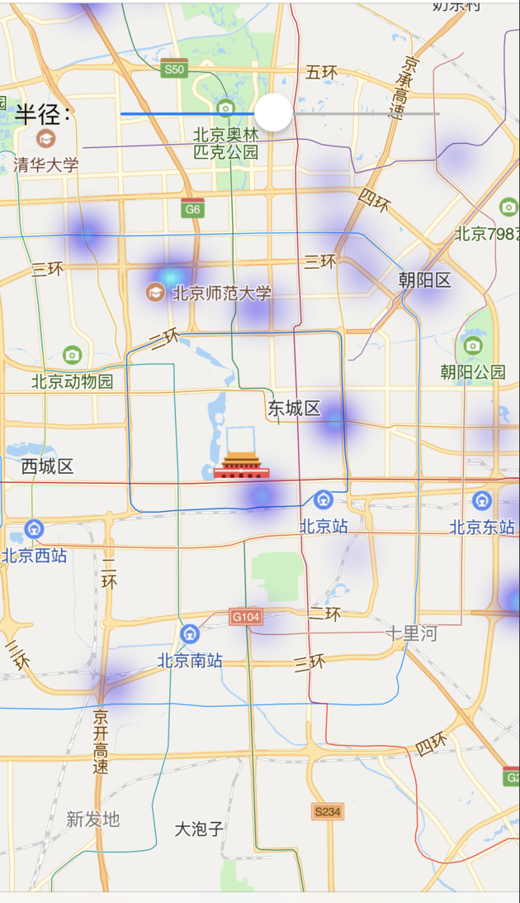

#### 设置热力图衰变半径

除去默认半径，用户还可以自定义热力图的半径，设置方法如下：

```objective-c
//设置半径接口
[self.heatTileOverlay setDecayRadius:50];

//重刷新渲染缓存
QHeatTileOverlayView *heatView = (QHeatTileOverlayView *)[self.mapView viewForOverlay:self.heatTileOverlay];
[heatView reloadData];
```

注意：更新热力图半径后，需重调用重载数据接口（reloadData)重刷新渲染缓存。

下图效果为衰变半径由默认设置为50后：

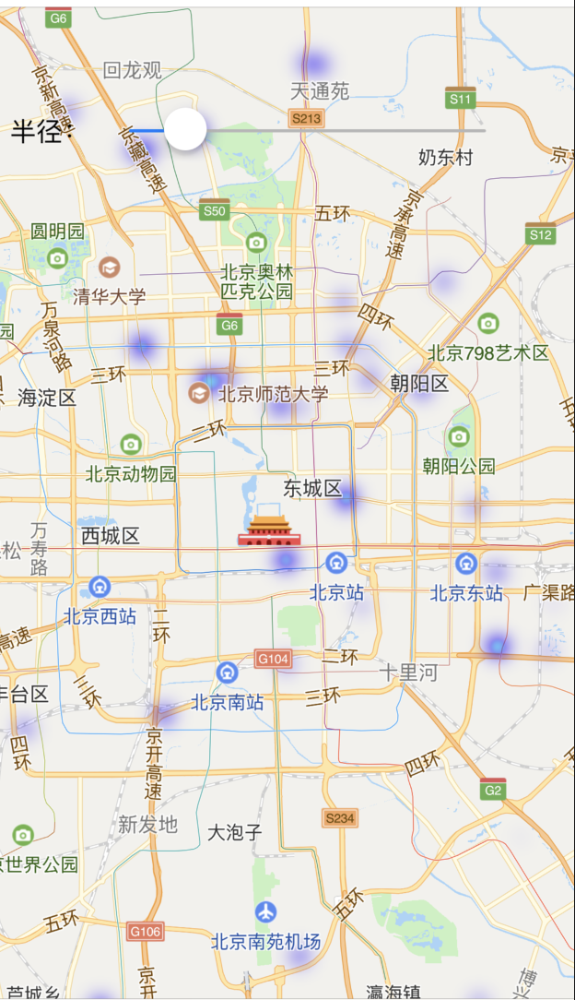

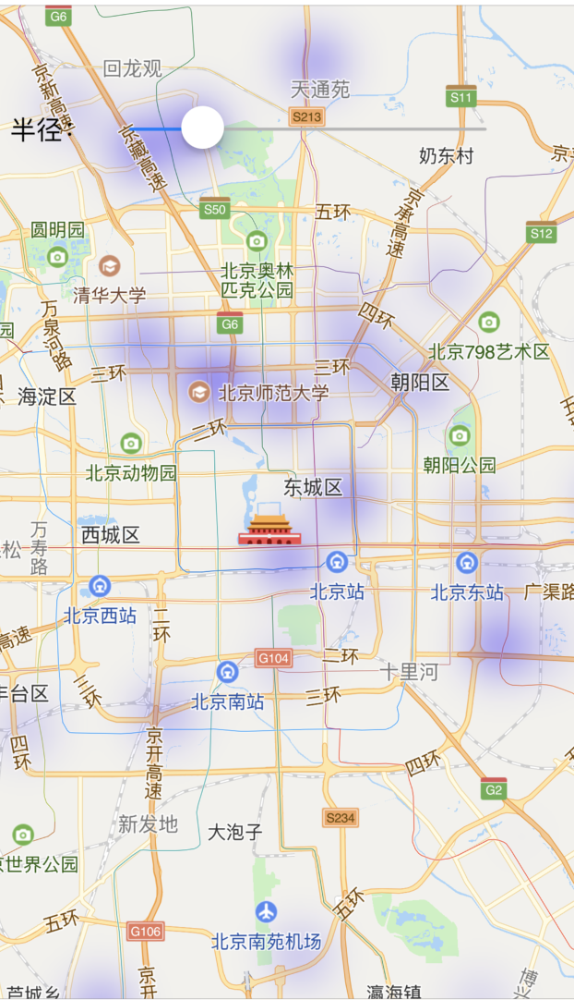

#### 设置热力图的颜色梯度

除去默认半径，用户还可以自定义热力图的半径。用户可通过 initWithColor:  andWithStartPoints: 接口重新设置gradient，示例方法如下：

```objective-c
/*
* @param colors      颜色列表
 * @param startPoints 颜色变化节点列表，需为严格递增数组(无相同值)，区间为[0, 1.0]
 * @return QHeatTileGradient
 *
 * @notes colors和startPoints的个数必须相同
 */
- (instancetype)initWithColor:(NSArray<UIColor *> *)colors andWithStartPoints:(NSArray<NSNumber *> *)startPoints;

//自定义颜色梯度
self.heatTileOverlay.gradient = [[QHeatTileGradient alloc] initWithColor:@[[UIColor grayColor],[UIColor brownColor], [UIColor blueColor],[UIColor greenColor],[UIColor yellowColor],[UIColor redColor]] andWithStartPoints:@[@(0.1),@(0.3),@(0.5), @(0.6), @(0.8),@(0.9)]];

QHeatTileOverlayView *heatView = (QHeatTileOverlayView *)[self.mapView viewForOverlay:self.heatTileOverlay];
[heatView reloadData];
```

注意：更新热力图颜色梯度后，需重调用重载数据接口（reloadData)重刷新渲染缓存。

效果图如下：


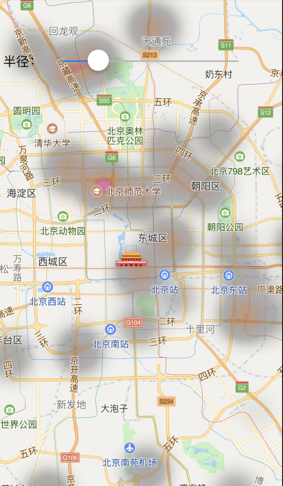

#### 移除热力图

用户可以通过接口 removeOverlay 移除对应的热力图，实现方法如下：

```objective-c
[self.mapView removeOverlay:self.heatTileOverlay];
```

详细示例请参考demo中的HeatViewController示例。


## 自定义瓦片

腾讯地图提供了添加瓦片图层的能力，为基础底层地图添加了额外的特性，支持开发者添加自定义瓦片数据，包括本地加载和在线下载两种方式。用户可通过添加自有瓦片数据在底层地图上显示某一景区详情或者某一商场信息等。

自定义瓦片图层类是QTileOverlay（QOverlay的子类），它定义了添加到基础地图的图片集合。 图层可随地图进行平移、缩放、旋转等操作变换，它位于底图之上(瓦片图层将会遮挡地图，不遮挡其他图层)，瓦片图层的添加顺序不会影响其他图层的叠加关系，适用于开发者拥有某区域的地图，并希望使用区域地图覆盖相应位置的腾讯地图。

#### 瓦片划分规则：

添加瓦片图层的前提是使用球面墨卡托投影生成了相应的瓦片，并按照生成的格式部署在您的服务器上。根据不同的比例尺将地图划分成若干个瓦片，并且以中心点经纬度(0,0)开始计算瓦片，当地图显示缩放级别增大时，每一个瓦片被划分成4 个瓦片。如： 地图级别为0时，只有1张瓦片；地图级别为1时，会分成4 张瓦片；地图级别为2时，会分成4的2次方 = 16 张瓦片。

#### 绘制方式：

对外提供自定义瓦片能力，用户可以通过接口来自行定义瓦片。为用户提供两种设置自定义瓦片的方式，1）本地图片方式  2）URL方式；

 

1）**本地图片方式**：用户在底图之上增加自定义2D图层，并且本地生成图片目标区域坐标系对应的图片数据，通过地图回调的接口设置给地图SDK，从而达到显示的效果。如2D热力图效果等。

1.使用本地图片需要将图片打包于应用内

2.生成QTileOverlay的一个子类并且重载QTileOverlay的loadTileAtPath: result:方法

```objective-c
//QTileOverlay子类
@interface LocalTile : QTileOverlay
@end

//重载loadTileAtPath: result:
  - (void)loadTileAtPath:(QTileOverlayPath)path result:(void (^)(NSData *, NSError *))result
{
  	//本地图片格式(示例为z-x-y.png), 数值顺序应为Z、x、y    
  NSString *imagePath = [NSString stringWithFormat:@"%d-%d-%d.png", (int)path.z, (int)path.x, (int)path.y];
    //本地图片的位置路径
    NSString *filePath = [[[NSBundle mainBundle] resourcePath] stringByAppendingPathComponent:@"localTiles"];
    //读取图片数据
    NSData *data = [NSData dataWithContentsOfFile:[filePath stringByAppendingPathComponent:imagePath]];
    if (data.length != 0)
    {
      	//把数据传入callback中
        result(data,nil);
    }
    else
    {
      //如读取失败则传入错误信息
       NSError *error = [NSError errorWithDomain:@"QTileLoadErrorDomain" code:-1 userInfo:@{NSLocalizedDescriptionKey: @"load tile data error"}];
        result(nil, error);
    }
}
```

 3.初始化QTileOverlay生成对象和生成对应的QTileOverlayView进行渲染

```objective-c
//初始化
LocalTile *localTile = [[LocalTile alloc] init];
//添加到mapview中
[self.mapView addOverlay:localTile];

//生成对应的QTileOverlayView
- (QOverlayView *)mapView:(QMapView *)mapView viewForOverlay:(id<QOverlay>)overlay
{
    //生成瓦片图的render
    if ([overlay isKindOfClass:[QTileOverlay class]]) {
        QTileOverlayView *render = [[QTileOverlayView alloc] initWithTileOverlay:overlay];
        return render;
    }
    return nil;
}
```

效果如下：

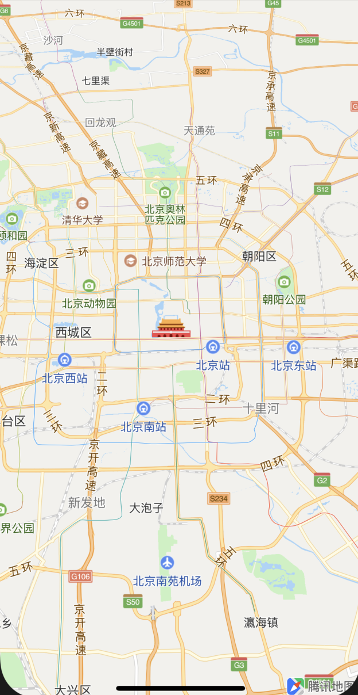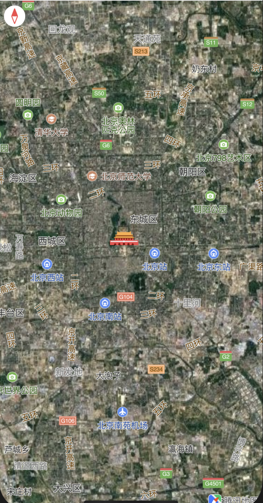

2）**URL方式**：用户在底图之上增加自定义2D图层，并且通过地图回调的接口将自定义瓦片的URL拼接规则设置设置给地图SDK，从而达到显示的效果。如自定义景区图层，卫星图，手绘图等。

1.设置对应的URL

```objective-c
//URL为NSString格式，如：http://server/path?x={x}&y={y}&z={z}&scale={scale}，其中"{x}", "{y}", "{z}", and "{scale}"会被替换为相应的值。

//谷歌地图图层的URL格式
#define TileTemplate    @"https://mt1.google.cn/vt/x={x}&y={y}&z={z}&scale={scale}"
```

2.根据指定的URL生成QTileOverlay对象

```objective-c
//初始化QTileOverlay对象
self.tileOverlayGG = [[QTileOverlay alloc] initWithURLTemplate:TileTemplate];

/*如使用默认缓存则需在添加overlay前设置存在文件夹名。如不设置文件夹名则不适用默认的缓存
 *如用户需使用自定义缓存，可以重载loadTileAtPath: result:方法
*/
self.tileOverlayGG.tileCacheDir = @"gg";

//添加到mapview中
[self.mapView addOverlay:self.tileOverlayGG];
```

3.实现QMapViewDelegate的mapView:  viewForOverlay: 函数，将瓦片显示在地图上：

```objective-c
- (QOverlayView *)mapView:(QMapView *)mapView viewForOverlay:(id<QOverlay>)overlay
{
    //生成瓦片图的render
    if ([overlay isKindOfClass:[QTileOverlay class]]) {
        QTileOverlayView *render = [[QTileOverlayView alloc] initWithTileOverlay:overlay];
        return render;
    }
    return nil;
}
```

效果图如下：

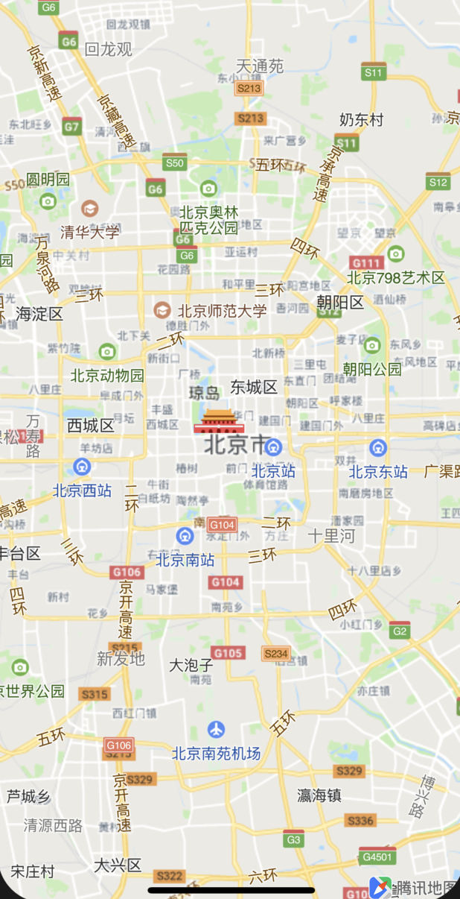


#### 更换瓦片图的压盖顺序

当地图同时存在多个自定义图层实例时，用户可通过调整zIndex改变各个自定义图层的压盖顺序。

```objective-c
/*找到对应的QTileOverlayView，例如：改变tileOverlayGG对应图层的zIndex
*通过 viewForOverlay:(id <QOverlay>)overlay 函数找到相应的图层 
*/
QTileOverlayView *tileOverlayView = (QTileOverlayView *)[self.mapView viewForOverlay:self.tileOverlayGG];

//更改zIndex
tileOverlayView.zIndex += 1;

```

更改zIndex后，图层压盖顺序会立即刷新

#### 移除瓦片图层

通过 removeOverlay: 函数可以移除对应的瓦片图层，同时也可以通过removeOverlays: 一次移除多个瓦片图层

```objective-c
//移除单个图层
[self.mapView removeOverlay:self.tileOverlayGG];

//移除多个图层，tileOverlays为QTileOverlay数组类
[self.mapView removeOverlay:self.tileOverlays];
```


# 定位

腾讯地图SDK（IOS）封装了系统定位，方便用户使用，在使用定位功能前，需要向info.plist文件中添加定位权限：(以下二选一，两个都添加默认使用NSLocationWhenInUseUsageDescription）：

- NSLocationWhenInUseUsageDescription：允许在前台使用时获取GPS的描述
- NSLocationAlwaysUsageDescription：允许永久使用GPS的描述

下面的代码可以开启定位功能：

```objective-c
- (void)setupMapView
{
    self.mapView = [[QMapView alloc] initWithFrame:self.view.bounds];
 
    self.mapView.delegate = self;
 
    [self.view addSubview:self.mapView];
    //开启定位
    [self.mapView setShowsUserLocation:YES];
}
 
//<QMapViewDelegate >中的定位回调函数
- (void)mapViewWillStartLocatingUser:(QMapView *)mapView
{
    NSLog(@"%s", __FUNCTION__);
}
 
- (void)mapViewDidStopLocatingUser:(QMapView *)mapView
{
    NSLog(@"%s", __FUNCTION__);
}
 
/**
 * @brief 用户位置更新后，会调用此函数
 * @param mapView 地图View
 * @param userLocation 新的用户位置
 * @param fromHeading 是否为heading 变化触发，如果为location变化触发,则为NO
 */
- (void)mapView:(QMapView *)mapView didUpdateUserLocation:(QUserLocation *)userLocation fromHeading:(BOOL)fromHeading
{
    NSLog(@"%s fromHeading = %d, location = %@, heading = %@", __FUNCTION__, fromHeading, userLocation.location, userLocation.heading);
}
 
/**
 * @brief  定位失败后，会调用此函数
 * @param mapView 地图View
 * @param error 错误号，参考CLError.h中定义的错误号
 */
- (void)mapView:(QMapView *)mapView didFailToLocateUserWithError:(NSError *)error
{
    NSLog(@"%s error = %@", __FUNCTION__, error);
}
 
/**
 * @brief 定位时的userTrackingMode 改变时delegate调用此函数
 *  @param mapView 地图View
 *  @param mode QMUserTrackingMode
 *  @param animated 是否有动画
 */
- (void)mapView:(QMapView *)mapView didChangeUserTrackingMode:(QUserTrackingMode)mode animated:(BOOL)animated
{
    NSLog(@"%s mode = %d, animated = %d", __FUNCTION__, mode, animated);
}
```


# 区域限制


## 1.简介：

腾讯地图SDK为用户提供了区域限制的功能接口，用户可以通过该接口将地图的显示区域固定在某一场景区域当中，当设置生效时，拖动地图不会超出设定的区域。区域限制功能适用于旅游景区、商场等场景，可以搭配腾讯地图SDK的手绘图、瓦片图等功能创造丰富的场景。

## 2.接口说明

进行区域限制时，可以调用QMapView中的 **setLimitMapRect:  mode:** 接口， 需传入相应的区域以及对应的区域展示对齐模式

```objective-c
/**
 * @brief  根据边界留宽显示限制地图区域范围(2D北朝上场景时)
 * @param mapRect 待调整的地理范围
 * @param mode    限制地区区域的对齐方式，分等宽对齐和等高对齐
 * 当传入的mapRect的值都为0时，取消区域限制
 */
-(void)setLimitMapRect:(QMapRect)mapRect mode:(QMapLimitRectFitMode)mode;
```

注意：限定区域设置生效后，**地图的最小显示级别将是限制区域的最小可显示级别**，地图默认最大显示级别没有变化。如：设置的限制区域最小可显示级别为14，则地图的最小显示级别为14，用户不能缩放到小于14的显示级别。

## 3.生成限制区域mapRect

限制区域接口的mapRect参数是QMapRect结构（平面投影矩形），生成对应的mapRect，用户需找到平面投影矩形左上角和右下角的经纬度坐标，然后通过SDK提供的接口转换成相应的QMapRect，示例如下：

**1）根据左上角和右下角的经纬度坐标生成 平面投影坐标（QMapPoint），以故宫的矩形为例子：**

```objective-c
// QMapPointForCoordinate 接口将经纬度坐标转换为平面投影坐标
QMapPoint mapPoint1 =  		QMapPointForCoordinate(CLLocationCoordinate2DMake(39.907053,116.395984));
    QMapPoint mapPoint2 = QMapPointForCoordinate(CLLocationCoordinate2DMake(39.900436,116.399567));
```

**2）通过两个 平面投影坐标 生成所需的QMapRect**

```objective-c
/*
 *	 QBoundingMapRectWithPoints(QMapPoint *points, NSUInteger count) 根据平面投影坐标返回外接矩形
 */
	
		// 平面投影坐标 点数组
		QMapPoint points[2];
    points[0] = mapPoint1;
    points[1] = mapPoint2;
		// 生成平面投影矩形
    QMapRect rect = QBoundingMapRectWithPoints(points, 2);
```

**3）限制区域显示的限制方式**

限制区域显示的限制方式有两种，分别以区域宽度为参考值和以区域高度为参考值

```objective-c
typedef NS_ENUM(NSInteger,QMapLimitRectFitMode) {
    QMapLimitRectFitWidth = 0,  // 此模式会以 mapRect宽度为参考值限制地图的控制区域，保证横向区域完全展示
    QMapLimitRectFitHeight      // 此模式会以 mapRect高度为参考值限制地图的控制区域，保证纵向区域完全展示
};
```

**4）进行区域限制**

用户生成了所需的QMapRect后可设置限制区域

```objective-c
// 以 mapRect高度为参考值限制地图的控制区域
[self.mapView setLimitMapRect:rect mode:QMapLimitRectFitHeight];

// 以 mapRect宽度为参考值限制地图的控制区域
[self.mapView setLimitMapRect:rect mode:QMapLimitRectFitWidth];
```

效果如下：

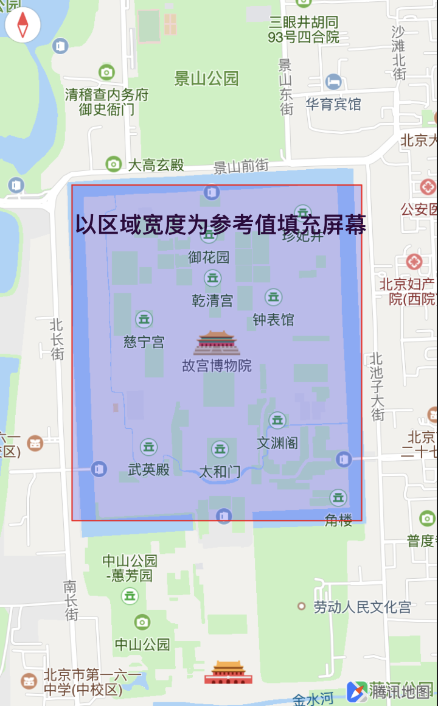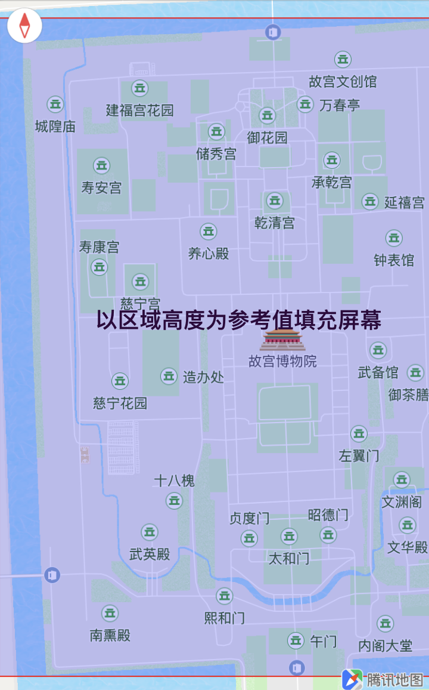 

**5）地图显示级别**

在 1）中提到，限制区域生效后，地图的最小显示级别会产生变化，以下显示级别相关接口会有影响：

**设置地图显示级别**

```objective-c
	// 当限制区域生效时，如果设置的显示级别小于限制区域的最小可显示级别，则设置的显示级别无效

 [self.mapView setZoomLevel:7]; //如限制区域的最小可显示级别是10，设置显示级别为7则无效
```


**设置地图最小、最大显示级别**

```objective-c
/* 当限制区域生效时，如果设置的显示级别小于限制区域的最小可显示级别，限制区域最小显示级别不变；
 *                如果设置的显示级别大于限制区域的最小可显示级别，限制区域最小显示级别为新设的值；
 */

//如限制区域的最小可显示级别是10，设置地图最小显示级别为7，限制区域最小显示级别不变，无法缩放到小于10的级别
[self.mapView setMinZoomLevel:7 maxZoomLevel:18]; 


//如限制区域的最小可显示级别是10，设置地图最小显示级别为7，限制区域最小显示级别不变，无法缩放到小于10的级别；设置地图最大显示级别为8，限制区域的最大、最小显示级别均为10；
[self.mapView setMinZoomLevel:7 maxZoomLevel:8]; 
```

## 4.取消区域限制

当需要取消区域限制时，用户可传入一个值都为0的QMapRect取消区域限制，方法如下：

```objective-c
// 当传入的mapRect的四个值为0时，可取消区域限制（无视对齐模式）
    QMapRect cancelRect = QMapRectMake(0, 0, 0, 0);
    [self.mapView setLimitMapRect:cancelRect mode:QMapLimitRectFitWidth];
```

**注意：**取消区域限制后，地图的可缩放区间恢复为地图当前的最小、最大显示级别之间。如果用户设置了限制区域后，通过 **setMinZoomLevel: maxZoomLevel:** 改变了地图的最小、最大显示级别，取消区域限制后，地图的可缩放区间为最后一个更改的最小、最大显示级别之间。


# POI检索

POI（Point of Interest，兴趣点）是地图中的一个重要元素，它可代表一个商铺、一个建筑物或者一个公交站等。腾讯地图iOS SDK提供给了多种POI搜索功能：POI指定地区搜索、POI周边搜索、POI矩形搜索。

## 使用须知

### 使用限制

针对个人开发者和企业开发者，提供的服务调用量有差别，可参考[配额限制说明](https://lbs.qq.com/webservice_v1/guide-quota.html)。

### 启用服务与安全设置

腾讯位置服务API Key，在调用时用于唯一标识开来者身份，API KEY是各产品通用的，也就是说同一个Key可以用在地图SDK，也可以用在JavascriptAPI，也可以用在WebServiceAPI以及其它各产品中，可针对不同产品可独立启用（开关）。**若在腾讯地图SDK中使用检索功能，需勾选WebServiceAPI选项。**
假设您的某个Key只会调用地图SDK，可在Key配置界面，将其它产品关闭，以降低安全风险。

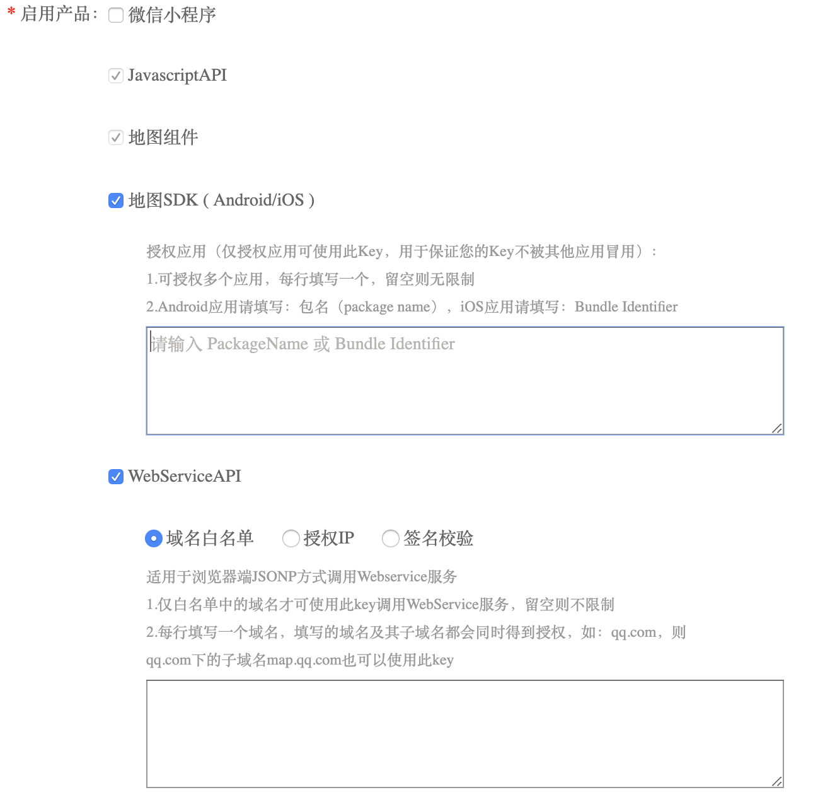


**关于API Key安全：**
腾讯位置服务的调用配额是开放到Key上的，为了防止您的Key被盗用，保障调用安全，我们在Key的设置中提供了多种安全策略：
[详细使用方法请点击了解>>](https://lbs.qq.com/FAQ/key_faq.html#4)

## 检索功能接入

### 引入头文件

**引入 QMSSearchKit.h头文件**

```objective-c
#import <QMapKit/QMSSearchKit.h>
```

**在AppDelegate.m 中设置已勾选WebServiceAPI的Key:**

```objective-c
#import <QMapKit/QMSSearchKit.h>

- (BOOL)application:(UIApplication *)application didFinishLaunchingWithOptions:(NSDictionary *)launchOptions {
    
    self.window = [[UIWindow alloc] initWithFrame:[[UIScreen mainScreen] bounds]];
    
    // Configure API Key.
    [QMapServices sharedServices].APIKey = @"您的APIKey";
    
    // 如需检索功能，请设置检索的API Key
    [[QMSSearchServices sharedServices] setApiKey:@"您的APIKey"];
  
}

```

**定义QMSSearcherAPI**

定义主搜索对象 QMSSearcherAPI，并继承搜索协议 < QMSSearchDelegate >

**构造QMSSearcherAPI**

构造主搜索对象 QMSSearcherAPI，并设置代理

```objective-c
self.mySearcher = [[QMSSearcher alloc] initWithDelegate: self];
```


## 关键字搜索POI

### 构建关键字搜索参数

##### 1.设置关键字搜索参数 QMSPoiSearchOption, **keyword为必填字段**

```objective-c
QMSPoiSearchOption poiSearchOption = [[QMSPoiSearchOption alloc] init];

[poiSearchOption setKeyword:@"餐厅"];
// 或者
poiSearchOption.keyword = @"餐厅";

```

##### 2.**page_size** 和 page_index 参数

​	**page_size **为 每页条目数，最大限制为20条， 默认10条。

​	**page_index** 为搜索结果的页数索引，第x页，默认为第1页。

```objective-c
//每页条目数
[poiSearchOption setPage_size:5];

poiSearchOption.page_size = 10;

// 页数索引
[poiSearchOption setPage_index: 3];

self.poiSearchOption.page_index = 3;

```

##### 3.**filter** 参数

filter为筛选条件，用户通过设置特定的条件对搜索结果进行过滤，**最多支持5个分类词**。

​	搜索指定分类：

​	 	例如传入“category=公交站”则最终会被组装为filter=category=公交站，筛选出包含“公交站”的结果分类

```objective-c
[poiSearchOption setFilter:@“category=公交站”];
```

​	搜索多个分类

​     	举例：category=大学,中学  (以英文逗号分隔筛选条件）筛选出包含“大学,中学”的结果分类

```objective-c
[poiSearchOption setFilter:@“category=大学,中学”];
```

​	

​	用户还可以传入NSString 类型数组通过 **setFilterByCategories:** 接口构建filter，最多支持5个分类词。

```objective-c
NSArray <NSString *> *filterArray = [NSArray arrayWithObjects:@"烧烤", @"日料", @"中餐", nil];
        
[poiSearchOption setFilterByCategories:filterArray];
```

**注：腾讯地图POI分类关键词参考: http://lbs.qq.com/webservice_v1/guide-appendix.html**

##### 4.orderby参数

orderby为排序方式，**目前仅支持周边搜索（boundary=nearby)**。支持按距离由近到远排序，默认取值取值：_distance, 以到boundary的中心点距离排序；当orderby为空时, 以POI权重排序。

### 搜索方式

**boundary** 为搜索地理范围，支持三个范围函数: 指定地区搜索，周边搜索和矩形搜索。

#### 指定地区搜索接口参数：

指定地区名称：boundary=region(city_name, [ auto_extend ], [ lat,lng ])

​     city_name：检索区域名称， 城市名字，如北京市。

​     auto_extend：可选参数。 **取值1：默认值，若当前城市搜索无结果，则自动扩大范围；**
​                                                   **取值0：仅在当前城市搜索。**

​      lat,lng：可选参数。 当用户使用泛关键词搜索时（如酒店、超市），这类搜索多为了查找附近，
​                                            使用此参数，**搜索结果以此坐标为中心，返回就近地点**，体验更优。

```objective-c
 // 仅在北京搜索
poiSearchOption.boundary = @"region(北京,0)"; 

// 以 39.901268,116.9403854 为中心，返回就近地点搜索结果;
poiSearchOption.boundary = @"region(北京,0, 39.901268,116.9403854)"; 
```

用户也能通过以下两个接口设置指定区域地理范围：

```objective-c
setBoundaryByRegionWithCityName: (NSString *)cityName autoExtend:(BOOL)isAutoEntend;

// 以某一坐标为中心点在某城市进行检索
setBoundaryByRegionWithCityName: (NSString *)cityName autoExtend:(BOOL)isAutoEntend center:(CLLocationCoordinate2D)coordinate;
```


##### 发起POI检索：

调用QMSSearcherAPI中的 searchWithPoiSearchOption 发起指定区域检索

```objective-c
[self.mySearcher searchWithPoiSearchOption: poiSearchOption];
```


##### 回调中出解析数据

当检索成功后，会调用到 searchWithPoiSearchOption: didReceiveResult: 回调函数，通过解析QMSPoiSearchResult 数据把所需的结果绘制到地图上。

```objective-c
- (void)searchWithPoiSearchOption:(QMSPoiSearchOption *)poiSearchOption didReceiveResult:(QMSPoiSearchResult *)poiSearchResult
{
  // 获取结果中的第一个POI数据 
  QMSPoiData *poiData = [poiSearchResult.dataArray objectAtIndex:0];
		
  NSLog(@"result is: %@", self.poiSearchResult);
  
  // 详细POI数据解析，请参考demo
}
```

##### 数据说明

​	1）poiSearchResult.count 可以获取本次搜索结果总数

​	2）poiSearchResult.dataArray 可以获取**当前page_index**搜索结果POI数组，每项为一个POI(QMSPoiData)对象

​	3）QMSPoiData 可以获取以下的属性：

|              属性               |                             说明                             |
| :-----------------------------: | :----------------------------------------------------------: |
|          NSString *id_          |                         POI唯一标识                          |
|         NSString *title         |                           poi名称                            |
|        NSString *address        |                             地址                             |
|          NSString *tel          |                             电话                             |
|       NSString *category        |                           POI分类                            |
|         QMSPoiType type         | POI类型，值说明：0:普通POI / 1:公交车站 / 2:地铁站 / 3:公交线路 / 4:行政区划 |
| CLLocationCoordinate2D location |                         坐标(经纬度)                         |
|        NSArray *boundary        | 轮廓，坐标数组，面积较大的POI会有，如住宅小区。数组里为CLLocationCoordinate2D类型数据  非必有字段 |

##### 效果图示例：

```objective-c
poiSearchOption.boundary = @"region(北京,0)";
poiSearchOption.keyword  = @"餐厅";
[self.mySearcher searchWithPoiSearchOption: poiSearchOption];
```

下图仅在地图上标记第一页的搜索结果

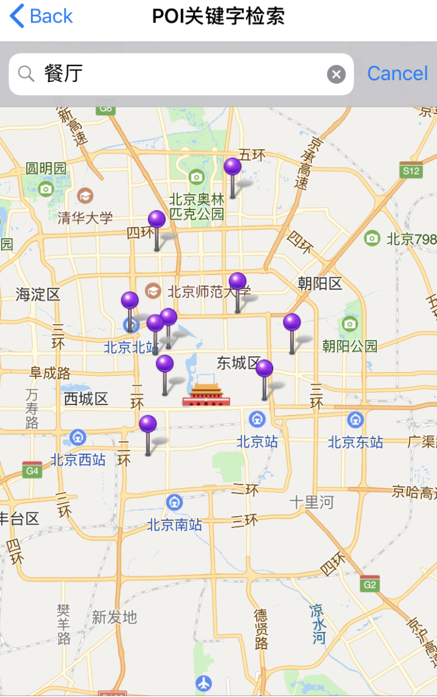


#### 周边搜索接口参数

周边搜索：

圆形区域范围 ：nearby([ lat,lng ],radius<半径/米>, [ auto_extend]) 
             radius：半径，最大支持1000米 
             auto_extend：可选参数,当前范围无结果时，是否自动扩大范围，取值：
                                  	1 [默认]自动扩大范围；
                                 	 0 不扩大

​			[ lat,lng ]   		搜索结果以此坐标为中心，返回就近地点

```objective-c
// 以 (39.908491,116.374328) 为中心，搜索半径500米范围
poiSearchOption.boundary = @"nearby(39.908491,116.374328,500,0)"; 
```

或调用 setBoundaryByNearbyWithCenterCoordinate:  radius:  autoExtend: 接口实现上述设置：

```objective-c
[poiSearchOption setBoundaryByNearbyWithCenterCoordinate:CLLocationCoordinate2DMake(39.908491,116.374328) radius:10 autoExtend:NO];
```


##### 发起POI检索：

调用QMSSearcherAPI中的 searchWithPoiSearchOption 发起周边区域检索

```objective-c
[self.mySearcher searchWithPoiSearchOption: poiSearchOption];
```


##### 在回调中处理搜索数据

当检索成功后，会调用到 searchWithPoiSearchOption: didReceiveResult: 回调函数，通过解析QMSPoiSearchResult 数据把所需的结果绘制到地图上。

```objective-c
- (void)searchWithPoiSearchOption:(QMSPoiSearchOption *)poiSearchOption didReceiveResult:(QMSPoiSearchResult *)poiSearchResult
{
  // 获取结果中的第一个POI数据 
  QMSPoiData *poiData = [poiSearchResult.dataArray objectAtIndex:0];
		
  NSLog(@"result is: %@", self.poiSearchResult);
  
  // 详细POI数据解析，请参考demo
}
```

QMSPoiData数据类说明请参考[数据说明](#数据说明)

##### 效果图示例

```objective-c
poiSearchOption.boundary = @"nearby(39.908491,116.374328,500,0)";
poiSearchOption.keyword  = @"餐厅";
[self.mySearcher searchWithPoiSearchOption: poiSearchOption];
```

下图仅在地图上标记第一页的搜索结果

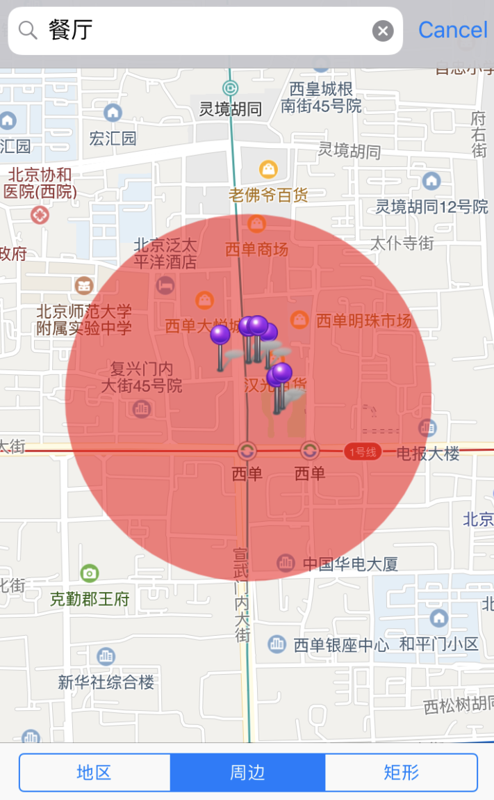

#### 矩形搜索接口参数

[矩形搜索]：

矩形范围 ：boundary=rectangle(lat,lng<左下/西南>, lat,lng<右上/东北>)

​					rectangle里需传入矩形的左下角坐标和右上角坐标

```objective-c
// 在左下角(39.908491,116.374328)，右上角(39.918491,116.384328)的矩形内搜索
poiSearchOption.boundary = @"rectangle(39.908491,116.374328,39.918491,116.384328)";
```

或使用 setBoundaryByRectangleWithleftBottomCoordinate: rightTopCoordinate: 接口设置boundary：

```objective-c
[poiSearchOption setBoundaryByRectangleWithleftBottomCoordinate:CLLocationCoordinate2DMake (39.908491,116.374328) rightTopCoordinate:CLLocationCoordinate2DMake (39.918491,116.384328)];
```

##### 发起POI检索：

调用QMSSearcherAPI中的 searchWithPoiSearchOption 发起矩形区域检索

```objective-c
[self.mySearcher searchWithPoiSearchOption: poiSearchOption];
```


##### 在回调中处理搜索数据

当检索成功后，会调用到 searchWithPoiSearchOption: didReceiveResult: 回调函数，通过解析QMSPoiSearchResult 数据把所需的结果绘制到地图上。

```objective-c
- (void)searchWithPoiSearchOption:(QMSPoiSearchOption *)poiSearchOption didReceiveResult:(QMSPoiSearchResult *)poiSearchResult
{
  // 获取结果中的第一个POI数据 
  QMSPoiData *poiData = [poiSearchResult.dataArray objectAtIndex:0];
		
  NSLog(@"result is: %@", self.poiSearchResult);
  
  // 详细POI数据解析，请参考demo
}
```

QMSPoiData数据类说明请参考[数据说明](#数据说明)

##### 效果示例图

```objective-c
[poiSearchOption setBoundaryByRectangleWithleftBottomCoordinate:CLLocationCoordinate2DMake (39.907293,116.368935) rightTopCoordinate:CLLocationCoordinate2DMake (39.914996,116.379321)];

poiSearchOption.keyword  = @"餐厅";

[self.mySearcher searchWithPoiSearchOption: poiSearchOption];
```

下图仅在地图上标记第一页的搜索结果

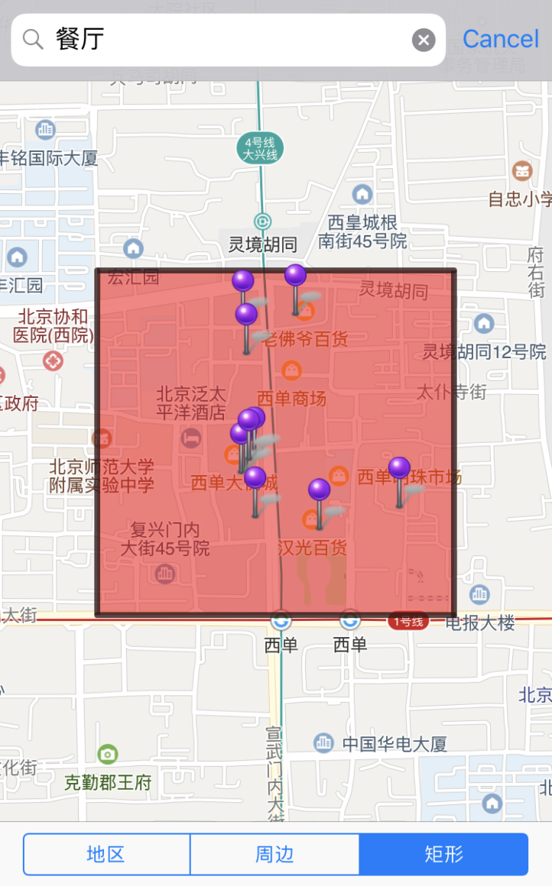


#### 错误信息回调

当检索失败时，回调函数 searchWithSearchOption: didFailWithError: 会返回对应的错误信息

```objective-c
- (void)searchWithSearchOption:(QMSSearchOption *)searchOption didFailWithError:(NSError *)error
{
    NSLog(@"%@",error);
}
```

更详细设置请参考demo


## 关键字提示检索

关键字提示检索是指根据用户输入的关键词，给出对应的提示信息，将最有可能的搜索词呈现给用户，减少用户输入信息，大大提升用户体验。如：输入“北京”，提示“北京站”，“北京西站”等。

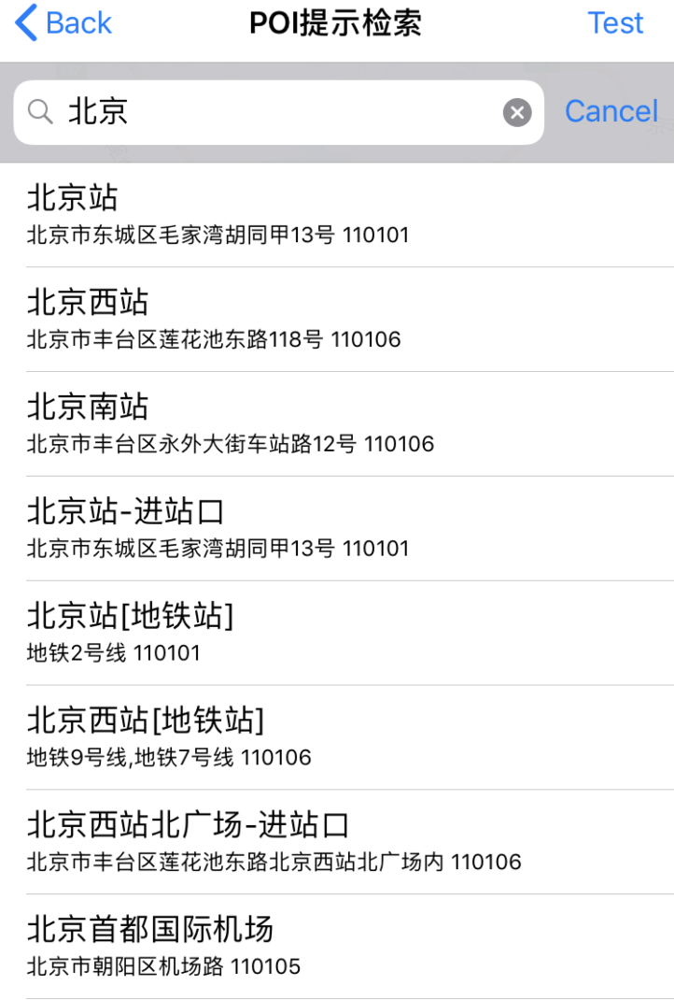

### 引入头文件

**引入 QMSSearchKit.h头文件**

```objective-c
#import <QMapKit/QMSSearchKit.h>
```

**在AppDelegate.m 中设置已勾选WebServiceAPI的Key:**

```objective-c
#import <QMapKit/QMSSearchKit.h>

- (BOOL)application:(UIApplication *)application didFinishLaunchingWithOptions:(NSDictionary *)launchOptions {
    
    self.window = [[UIWindow alloc] initWithFrame:[[UIScreen mainScreen] bounds]];
    
    // Configure API Key.
    [QMapServices sharedServices].APIKey = @"您的APIKey";
    
    // 如需检索功能，请设置检索的API Key
    [[QMSSearchServices sharedServices] setApiKey:@"您的APIKey"];
  
}

```

**注**：请用户确认API Key已勾选WebServiceAPI选项，具体设置请参考[设置](https://lbs.qq.com/webservice_v1/index.html)

**定义QMSSearcherAPI**

定义主搜索对象 QMSSearcherAPI，并继承搜索协议 < QMSSearchDelegate >

**构造QMSSearcherAPI**

构造主搜索对象 QMSSearcherAPI，并设置代理

```objective-c
self.mySearcher = [[QMSSearcher alloc] initWithDelegate: self];
```


### 关键字提示检索参数说明

设置关键字提示输入参数 QMSSuggestionSearchOption，其中 **keyword** 和 **region** 是必填字段

```objective-c
QMSSuggestionSearchOption sugOption = [[QMSSuggestionSearchOption alloc] init];

sugOption.keyword = @"北京南";

sugOption.region	=	@"北京"
```

其他参数说明

|           属性           |                             说明                             |
| :----------------------: | :----------------------------------------------------------: |
|     NSString *filter     | 搜索指定分类，例如传入“category=公交站；搜索多个分类，举例：category=大学,中学 |
|   NSNumber *region_fix   | 0：[默认]当前城市无结果时，自动扩大范围到全国匹配  1：固定在当前城市 |
|    NSString *location    | 定位坐标，传入后，若用户搜索关键词为类别词（如酒店、餐馆时），与此坐标距离近的地点将靠前显示，格式： location=lat,lng |
|  NSNumber *get_subpois   | 是否返回子地点，如大厦停车场、出入口等；0 [默认]不返回，1 返回 |
|     NSNumber *policy     | 检索策略，目前支持：policy=0：默认，常规策略；policy=1：本策略主要用于收货地址、上门服务地址的填写，提高了小区类、商务楼宇、大学等分类的排序，过滤行政区、道路等分类（如海淀大街、朝阳区等），排序策略引入真实用户对输入提示的点击热度，使之更为符合此类应用场景，体验更为舒适；policy=10：出行场景（网约车） – 起点查询；policy=11：出行场景（网约车） – 终点查询 |
| NSString *address_format |          可选值：short   返回“不带行政区划的”短地址          |
|   NSNumber *page_index   | 页码，从1开始，最大页码需通过count进行计算，必须与page_size同时使用 |
|   NSNumber *page_size    |       每页条数，取值范围1-20，必须与page_index 时使用        |


### 发起关键字提示检索

调用QMSSearcherAPI中的 searchWithSuggestionSearchOption 发起关键字提示检索

```objective-c
[self.mySearcher searchWithSuggestionSearchOption:sugOption];
```


### 在回调中处理搜索数据

当检索成功后，会调用到 searchWithSuggestionSearchOption: didReceiveResult: 回调函数，通过解析QMSSuggestionResult 数据把所需的结果绘制到地图上。

```objective-c
- (void)searchWithSuggestionSearchOption:(QMSSuggestionSearchOption *)suggestionSearchOption didReceiveResult:(QMSSuggestionResult *)suggestionSearchResult
{
    self.sugResult = suggestionSearchResult;
    
    NSLog(@"suggest result:%@", suggestionSearchResult);
}
```

在回调中，可通过QMSSuggestionResult中的dataArray获取QMSSuggestionPoiData对象，从中得到POI数据

```objective-c
// 获取第一个POI数据
QMSSuggestionPoiData *poiData = [suggestionSearchResult.dataArray objectAtIndex:0];

// 获取第一个subPOI数据
QMSSuggestionSubPoiData *subPOIData = [suggestionSearchResult.sub_pois objectAtIndex:0];
```


**QMSSuggestionResult** 数据说明：

**count**:	本次搜索结果总数

**NSArray *dataArray**: 提示词数组，每项为一个POI(QMSSuggestionPoiData)对象

​	**QMSSuggestionPoiData**类参数说明

|              属性               |                             说明                             |
| :-----------------------------: | :----------------------------------------------------------: |
|          NSString *id_          |                         POI唯一标识                          |
|         NSString *title         |                           提示文字                           |
|        NSString *address        |                         地址详细描述                         |
|        NSNumber *adcode         |                           邮政编码                           |
|       NSString *province        |                              省                              |
|         NSString *city          |                              市                              |
|         QMSPoiType type         | POI类型，值说明：0:普通POI / 1:公交车站 / 2:地铁站 / 3:公交线路 / 4:行政区划 |
| CLLocationCoordinate2D location |                         坐标(经纬度)                         |

**NSArray *sub_pois**：子地点列表，仅在输入参数get_subpois=1时返回. 每项为一个POI(QMSSuggestionSubPoiData)对象

​	 **QMSSuggestionSubPoiData**属性说明：

|              属性               |      说明       |
| :-----------------------------: | :-------------: |
|       NSString *parent_id       | 上级POI唯一标识 |
|          NSString *id_          |   POI唯一标识   |
|         NSString *title         |    提示文字     |
|        NSString *address        |  地址详细描述   |
|        NSNumber *adcode         |    邮政编码     |
|       NSString *province        |       省        |
|         NSString *city          |       市        |
| CLLocationCoordinate2D location |  坐标(经纬度)   |

#### 效果示例图

```objective-c
QMSSuggestionSearchOption sugOption = [[QMSSuggestionSearchOption alloc] init];

sugOption.keyword = @"北京南";

sugOption.region	=	@"北京"
  
[self.mySearcher searchWithSuggestionSearchOption:sugOption];
```

提示输入检索结果的第一页数据

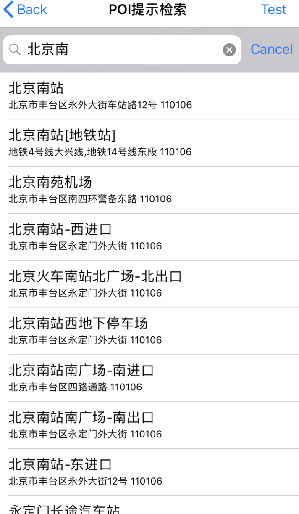

点击选择北京南站后：

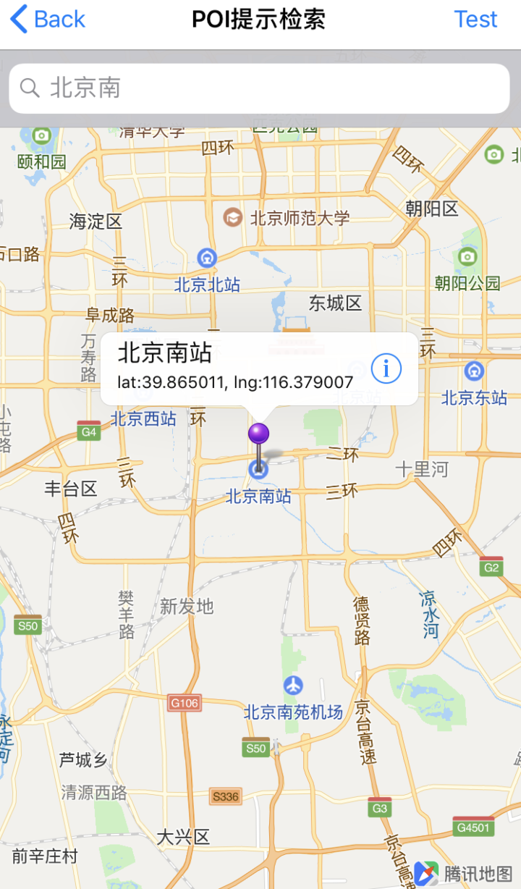

### 错误信息回调

当检索失败时，回调函数 searchWithSearchOption: didFailWithError: 会返回对应的错误信息

```objective-c
- (void)searchWithSearchOption:(QMSSearchOption *)searchOption didFailWithError:(NSError *)error
{
    NSLog(@"%@",error);
}
```

更详细设置请参考demo


## 逆地址解析（坐标位置描述）

逆地址解析提供由坐标到坐标所在位置的文字描述的转换。输入坐标返回地理位置信息和附近poi列表。目前应用于物流、出行、O2O、社交等场景。服务响应速度快、稳定，支撑亿级调用。
     1）满足传统对省市区、乡镇村、门牌号、道路及交叉口、河流、湖泊、桥、poi列表的需求。
     2）业界首创，提供易于人理解的地址描述：海淀区中钢国际广场(欧美汇购物中心北)。
     3）提供精准的商圈、知名的大型区域、附近知名的一级地标、代表当前位置的二级地标等。

### 引入头文件

**引入 QMSSearchKit.h头文件**

```objective-c
#import <QMapKit/QMSSearchKit.h>
```

**在AppDelegate.m 中设置已勾选WebServiceAPI的Key:**

```objective-c
#import <QMapKit/QMSSearchKit.h>

- (BOOL)application:(UIApplication *)application didFinishLaunchingWithOptions:(NSDictionary *)launchOptions {
    
    self.window = [[UIWindow alloc] initWithFrame:[[UIScreen mainScreen] bounds]];
    
    // Configure API Key.
    [QMapServices sharedServices].APIKey = @"您的APIKey";
    
    // 如需检索功能，请设置检索的API Key
    [[QMSSearchServices sharedServices] setApiKey:@"您的APIKey"];
  
}

```

**注**：请用户确认API Key已勾选WebServiceAPI选项，具体设置请参考[设置](https://lbs.qq.com/webservice_v1/index.html)

**定义QMSSearcherAPI**

定义主搜索对象 QMSSearcherAPI，并继承搜索协议 < QMSSearchDelegate >

**构造QMSSearcherAPI**

构造主搜索对象 QMSSearcherAPI，并设置代理

```objective-c
self.mySearcher = [[QMSSearcher alloc] initWithDelegate: self];
```

### 逆地址解析接口参数

设置逆地址解析检索参数 QMSReverseGeoCodeSearchOption，其中 location 为必填字段

```objective-c
QMSReverseGeoCodeSearchOption revGeoOption = [QMSReverseGeoCodeSearchOption alloc] init];
  
[revGeoOption setLocationWithCenterCoordinate:CLLocationCoordinate2DMake(39.907053,116.395984)];
```

参数说明：

**NSString** ***location**： 位置坐标，格式：  location=lat<纬度>,lng<经度>

**NSString *poi_options**：用于控制POI列表：

​		 **1 poi_options=address_format=short**

 		  返回短地址，缺省时返回长地址

 		 **2 poi_options=radius=5000**

 		 半径，取值范围 1-5000（米）

​		 **3 poi_options=page_size=20**

​		  每页条数，取值范围 1-20

​		  **4 poi_options=page_index=1**

​		  页码，取值范围 1-20

​		  **注：分页时page_size与page_index参数需要同时使用**

​		   **5 poi_options=policy=1/2/3/4/5**

​			  控制返回场景，

​		  	policy=1[默认] 以地标+主要的路+近距离POI为主，着力描述当前位置；

​		 	  policy=2 到家场景：筛选合适收货的POI，并会细化收货地址，精确到楼栋；

​		  	 policy=3 出行场景：过滤掉车辆不易到达的POI(如一些景区内POI)，增加道路出入口、交叉口、大区域出				入口类POI，排序会根据真实API大用户的用户点击自动优化。

​				policy=4 社交签到场景，针对用户签到的热门地点进行优先排序。

​		  	  policy=5 位置共享场景，用户经常用于发送位置、位置分享等场景的热门地点优先排序

​		  **6 poi_options=category=分类词1,分类词2，**

​		  	指定分类，多关键词英文分号分隔；

​		 	（支持类别参见：[附录](https://lbs.qq.com/webservice_v1/guide-appendix.html)）

​		  【单个参数写法示例】：

 				**poi_options=address_format=short**

 		【多个参数英文分号间隔，写法示例】：

 				 **poi_options=address_format=short;radius=5000;**

 				 **page_size=20;page_index=1;policy=2**

```objective-c
revGeoOption.poi_options = @"address_format=short";

revGeoOption.poi_options = @"address_format=short;radius=5000;page_size=20;page_index=1;policy=2";
```

**BOOL** get_poi：是否返回周边POI列表 默认不返回


### 发起逆地址解析检索

调用QMSSearcherAPI中的 searchWithReverseGeoCodeSearchOption 发起逆地址解析检索

```objective-c
[self.mySearcher searchWithReverseGeoCodeSearchOption:revGeoOption];
```


### 在回调中处理搜索数据

当检索成功后，会调用到 searchWithReverseGeoCodeSearchOption: didReceiveResult: 回调函数，通过解析QMSReverseGeoCodeSearchResult 数据把所需的结果绘制到地图上。

```objective-c
- (void)searchWithReverseGeoCodeSearchOption:(QMSReverseGeoCodeSearchOption *)reverseGeoCodeSearchOption didReceiveResult:(QMSReverseGeoCodeSearchResult *)reverseGeoCodeSearchResult
{
    self.revResult = reverseGeoCodeSearchResult;
    NSLog(@"get result %@",self.revResult);   
}
```

QMSReverseGeoCodeSearchResult 属性说明：

|                        属性                         |                         说明                          |
| :-------------------------------------------------: | :---------------------------------------------------: |
|                  NSString *address                  |                       地址描述                        |
| QMSReGeoCodeFormattedAddresses *formatted_addresses |                       位置描述                        |
|       QMSAddressComponent *address_component        |        地址部件，address不满足需求时可自行拼接        |
|             QMSReGeoCodeAdInfo *ad_info             |                     行政区划信息                      |
|   QMSReGeoCodeAddressReference *address_reference   |                   坐标相对位置参考                    |
|                 NSArray *poisArray                  | POI数组，对象中每个子项为一个POI(QMSReGeoCodePoi)对象 |
|                NSUInteger poi_count                 |                  查询的周边poi的总数                  |

从poisArray中可获取地址附近的POI （QMSReGeoCodePoi 类）信息，属性说明：

|              属性               |                 说明                  |
| :-----------------------------: | :-----------------------------------: |
|          NSString *id_          |              POI唯一标识              |
|         NSString *title         |                poi名称                |
|        NSString *address        |                 地址                  |
|       NSString *category        |                POI分类                |
| CLLocationCoordinate2D location |             坐标(经纬度)              |
|        double _distance         | 该POI到逆地址解析传入的坐标的直线距离 |

QMSReverseGeoCodeSearchResult 属性说明表格的其他类详情请参考 QMSSearchResult.h文件。

#### 效果示例图：

```objective-c
QMSReverseGeoCodeSearchOption *revGeoOption = [[QMSReverseGeoCodeSearchOption alloc] init];
    
[revGeoOption setLocationWithCenterCoordinate:coordinate];
 
[revGeoOption setGet_poi:YES];

revGeoOption.poi_options = @"page_size=5;page_index=1";
    
[self.mySearcher searchWithReverseGeoCodeSearchOption:revGeoOption];
```

在地上长按生成标记点：

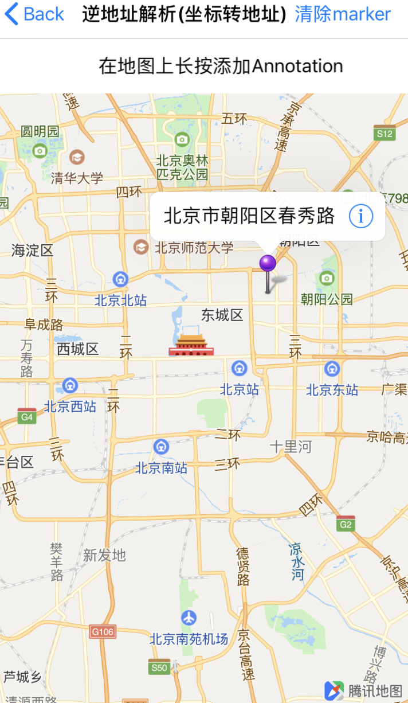

逆地址解析的信息：

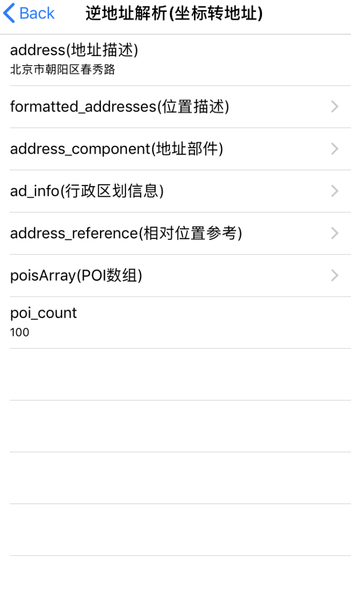

### 错误信息回调

当检索失败时，回调函数 searchWithSearchOption: didFailWithError: 会返回对应的错误信息

```objective-c
- (void)searchWithSearchOption:(QMSSearchOption *)searchOption didFailWithError:(NSError *)error
{
    NSLog(@"%@",error);
}
```

更详细设置请参考demo


## 地址解析（地址转坐标）

地址解析提供由地址描述到所述位置坐标的转换，与逆地址解析的过程正好相反。


### 引入头文件

**引入 QMSSearchKit.h头文件**

```objective-c
#import <QMapKit/QMSSearchKit.h>
```

**在AppDelegate.m 中设置已勾选WebServiceAPI的Key:**

```objective-c
#import <QMapKit/QMSSearchKit.h>

- (BOOL)application:(UIApplication *)application didFinishLaunchingWithOptions:(NSDictionary *)launchOptions {
    
    self.window = [[UIWindow alloc] initWithFrame:[[UIScreen mainScreen] bounds]];
    
    // Configure API Key.
    [QMapServices sharedServices].APIKey = @"您的APIKey";
    
    // 如需检索功能，请设置检索的API Key
    [[QMSSearchServices sharedServices] setApiKey:@"您的APIKey"];
  
}

```

**注**：请用户确认API Key已勾选WebServiceAPI选项，具体设置请参考[设置](https://lbs.qq.com/webservice_v1/index.html)

**定义QMSSearcherAPI**

定义主搜索对象 QMSSearcherAPI，并继承搜索协议 < QMSSearchDelegate >

**构造QMSSearcherAPI**

构造主搜索对象 QMSSearcherAPI，并设置代理

```objective-c
self.mySearcher = [[QMSSearcher alloc] initWithDelegate: self];
```


### 地址解析接口参数

设置地址解析检索参数 QMSGeoCodeSearchOption，其中 address 为必填字段

NSString *address： 必填	用于做地理编码的地址	 比如:address=北京市海淀区彩和坊路海淀西大街74号

NSString *region：    指定地址所属城市	例如:region=北京

示例：

```objective-c
QMSGeoCodeSearchOption *geoOption = [[QMSGeoCodeSearchOption alloc] init];
[geoOption setAddress:@"北京市海淀区彩和坊路海淀西大街74号"];
[geoOption setRegion:@"北京"];
```


### 发起地址解析检索

调用QMSSearcherAPI中的 searchWithGeoCodeSearchOption 发起地址解析检索

```objective-c
[self.mySearcher searchWithGeoCodeSearchOption:revGeoOption];
```


### 在回调中处理搜索数据

当检索成功后，会调用到 searchWithGeoCodeSearchOption: didReceiveResult: 回调函数，通过解析QMSGeoCodeSearchResult 数据把所需的结果绘制到地图上。

```objective-c
- (void)searchWithGeoCodeSearchOption:(QMSGeoCodeSearchOption *)geoCodeSearchOption didReceiveResult:(QMSGeoCodeSearchResult *)geoCodeSearchResult
{ 
    NSLog(@"geoCodeResult: %@", geoCodeSearchResult);
}
```

QMSReverseGeoCodeSearchResult类属性说明：

|                  属性                   |         说明         |
| :-------------------------------------: | :------------------: |
|     CLLocationCoordinate2D location     | 解析到的坐标(经纬度) |
| QMSAddressComponent *address_components |   解析后的地址部件   |
|        QMSGeoCodeAdInfo *ad_info        |     行政区划信息     |

表格中的QMSAddressComponent 和 QMSGeoCodeAdInfo 详细类别请参考QMSSearchResult.h文件说明

#### 效果示例图：

```objective-c
QMSGeoCodeSearchOption *geoOption = [[QMSGeoCodeSearchOption alloc] init];
[geoOption setAddress:@"北京市海淀区彩和坊路海淀西大街74号"];
[geoOption setRegion:@"北京"];
[self.mySearcher searchWithGeoCodeSearchOption:revGeoOption];
```

根据地址检索出的结果生成对应的POI点：

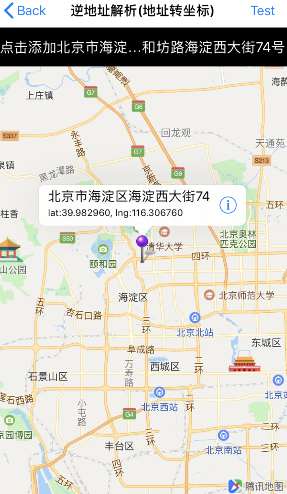

POI信息详情：

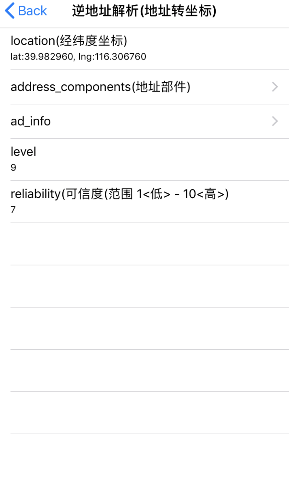

### 错误信息回调

当检索失败时，回调函数 searchWithSearchOption: didFailWithError: 会返回对应的错误信息

```objective-c
- (void)searchWithSearchOption:(QMSSearchOption *)searchOption didFailWithError:(NSError *)error
{
    NSLog(@"%@",error);
}
```

更详细设置请参考demo


## 行政区域检索

行政区域检索功能提供中国标准行政区划数据，可用于生成城市列表控件等功能时使用。

### 引入头文件

**引入 QMSSearchKit.h头文件**

```objective-c
#import <QMapKit/QMSSearchKit.h>
```

**在AppDelegate.m 中设置已勾选WebServiceAPI的Key:**

```objective-c
#import <QMapKit/QMSSearchKit.h>

- (BOOL)application:(UIApplication *)application didFinishLaunchingWithOptions:(NSDictionary *)launchOptions {
    
    self.window = [[UIWindow alloc] initWithFrame:[[UIScreen mainScreen] bounds]];
    
    // Configure API Key.
    [QMapServices sharedServices].APIKey = @"您的APIKey";
    
    // 如需检索功能，请设置检索的API Key
    [[QMSSearchServices sharedServices] setApiKey:@"您的APIKey"];
}
```

**注**：请用户确认API Key已勾选WebServiceAPI选项，具体设置请参考[设置](https://lbs.qq.com/webservice_v1/index.html)

**定义QMSSearcherAPI**

定义主搜索对象 QMSSearcherAPI，并继承搜索协议 < QMSSearchDelegate >

**构造QMSSearcherAPI**

构造主搜索对象 QMSSearcherAPI，并设置代理

```objective-c
self.mySearcher = [[QMSSearcher alloc] initWithDelegate: self];
```


### 行政区域检索接口参数

设置关键字行政区域检索参数 QMSDistrictSearchSearchOption，其中 keyword 为必填字段

```objective-c
QMSDistrictSearchSearchOption *distOpt = [[QMSDistrictSearchSearchOption alloc] init];
[distOpt setKeyword:@"北京"];
```

参数说明：

NSString *keyword：搜索关键词： 
									1.支持输入一个文本关键词 ：keyword=北京
									2.支持多个行政区划代码，英文逗号分隔：keyword=130681,419001


设置全部行政区域检索参数 QMSDistrictListSearchOption

```objective-c
QMSDistrictListSearchOption *listOpt = [[QMSDistrictListSearchOption alloc] init];
```

该参数无必填字段，初始化后即可发起行政区域检索。


设置子级行政区域检索参数 QMSDistrictChildrenSearchOption

```objective-c
QMSDistrictChildrenSearchOption *childOpt = [[QMSDistrictChildrenSearchOption alloc] init];
[childOpt setID:@"110000"];
```

参数说明：

**NSString *ID：父级行政区划ID，缺省时则返回最顶级行政区划**


### 发起行政区域检索

调用QMSSearcherAPI中的 searchWithDistrictSearchSearchOption 发起行政区域检索

```objective-c
 [self.mySearcher searchWithDistrictSearchSearchOption:distOpt];
```


调用QMSSearcherAPI中的 searchWithDistrictListSearchOption 发起全国行政区域检索

```objective-c
[self.mySearcher searchWithDistrictListSearchOption:listOpt];
```


调用QMSSearcherAPI中的 searchWithDistrictChildrenSearchOption 发起子级行政区域检索

```objective-c
[self.mySearcher searchWithDistrictChildrenSearchOption:childOpt];
```


### 在回调中处理搜索数据

当检索成功后，会调用到 searchWithDistrictSearchOption: didReceiveResult: 回调函数，通过解析QMSDistrictSearchResult 数据把所需的结果绘制到地图上。

```objective-c
- (void)searchWithDistrictSearchOption:(QMSDistrictBaseSearchOption *)districtSearchOption didRecevieResult:(QMSDistrictSearchResult *)districtSearchResult
{
    self.distResult = districtSearchResult;
    NSLog(@"%@",self.distResult);
}
```

**QMSDistrictSearchResult**类属性说明：

**NSArray<NSArray<QMSDistrictData  *>  *>  *result**：结果数组，第0项，代表一级行政区划，第1项代表二级行政区划，以此类推；使用getchildren接口时，仅为指定父级行政区划的子级； **元素类型包含QMSDistrictData元素的数组**

**QMSDistrictData**类属性说明：

|              属性               |                             说明                             |
| :-----------------------------: | :----------------------------------------------------------: |
|          NSString *id_          | 行政区划唯一标识；注：省直辖地区，在数据表现上有一个重复的虚拟节点（其id最后两位为99），其目的是为了表明省直辖关系而增加的，开发者可根据实际需要选用 |
|         NSString *name          |                       简称，如“内蒙古”                       |
|       NSString *fullname        |                    全称，如“内蒙古自治区”                    |
| CLLocationCoordinate2D location |                      中心点坐标(经纬度)                      |
|   NSArray<NSString *> *pinyin   | 行政区划拼音，每一下标为一个字的全拼，如：["nei","meng","gu"] |
|    NSArray<NSNumber *> *cidx    |              子级行政区划在下级数组中的下标位置              |

**获取检索结果result里的数据可以参考demo**

#### 效果示例图

使用 QMSDistrictSearchSearchOption参数搜索 “北京”：

```objective-c
QMSDistrictSearchSearchOption *distOpt = [[QMSDistrictSearchSearchOption alloc] init];
[distOpt setKeyword:@"北京"];
[self.mySearcher searchWithDistrictSearchSearchOption:distOpt];
```

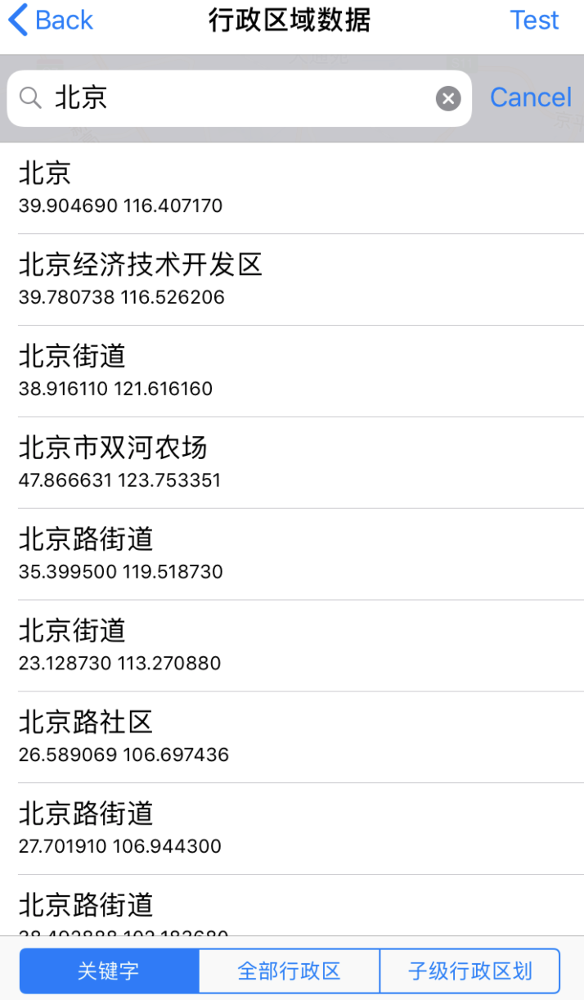


使用 QMSDistrictListSearchOption参数搜索：

```objective-c
QMSDistrictListSearchOption *listOpt = [[QMSDistrictListSearchOption alloc] init];
[self.mySearcher searchWithDistrictListSearchOption:listOpt];
```

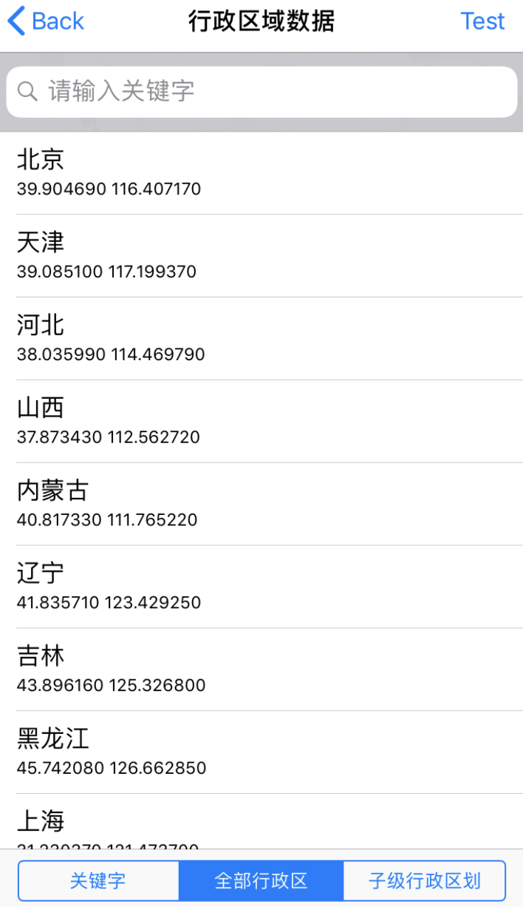


使用 QMSDistrictChildrenSearchOption参数搜索"110000"：

```objective-c
QMSDistrictChildrenSearchOption *childOpt = [[QMSDistrictChildrenSearchOption alloc] init];
[childOpt setID:@"110000"];
[self.mySearcher searchWithDistrictChildrenSearchOption:childOpt];
```

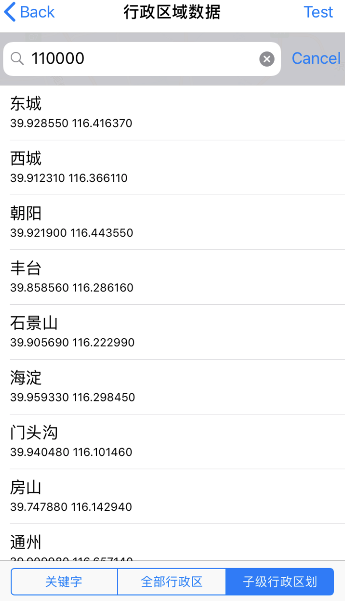


### 错误信息回调

当检索失败时，回调函数 searchWithSearchOption: didFailWithError: 会返回对应的错误信息

```objective-c
- (void)searchWithSearchOption:(QMSSearchOption *)searchOption didFailWithError:(NSError *)error
{
    NSLog(@"%@",error);
}
```

更详细设置请参考demo


# 出行规划

腾讯地图SDK 检索API，提供多种交通方式的路线计算能力，包括：
        1. 驾车（driving）：支持结合实时路况、少收费、不走高速等多种偏好，精准预估到达时间（ETA）；
        2. 步行（walking）：基于步行路线规划。

3. 公交（transit）：支持公共汽车、地铁等多种公共交通工具的换乘方案计算；


## 驾车路线规划

### 引入头文件

**引入 QMSSearchKit.h头文件**

```objective-c
#import <QMapKit/QMSSearchKit.h>
```

**在AppDelegate.m 中设置已勾选WebServiceAPI的Key:**

```objective-c
#import <QMapKit/QMSSearchKit.h>

- (BOOL)application:(UIApplication *)application didFinishLaunchingWithOptions:(NSDictionary *)launchOptions {
    
    self.window = [[UIWindow alloc] initWithFrame:[[UIScreen mainScreen] bounds]];
    
    // Configure API Key.
    [QMapServices sharedServices].APIKey = @"您的APIKey";
    
    // 如需检索功能，请设置检索的API Key
    [[QMSSearchServices sharedServices] setApiKey:@"您的APIKey"];
}
```

**注**：请用户确认API Key已勾选WebServiceAPI选项，具体设置请参考[设置](https://lbs.qq.com/webservice_v1/index.html)

**定义QMSSearcherAPI**

定义主搜索对象 QMSSearcherAPI，并继承搜索协议 < QMSSearchDelegate >

**构造QMSSearcherAPI**

构造主搜索对象 QMSSearcherAPI，并设置代理

```objective-c
self.mySearcher = [[QMSSearcher alloc] initWithDelegate: self];
```


### 设置驾车路线规划参数

设置 QMSDrivingRouteSearchOption 参数

```objective-c
  QMSDrivingRouteSearchOption *drivingOpt = [[QMSDrivingRouteSearchOption alloc] init];
  [drivingOpt setPolicyWithType:QMSDrivingRoutePolicyTypeLeastTime];
  [drivingOpt setFrom:@"39.983906,116.307999"];
  [drivingOpt setTo:@"39.979381,116.314128"];
```

其中 from 和 to 是必填字段

QMSDrivingRouteSearchOption 参数说明

|          属性          |                             说明                             |
| :--------------------: | :----------------------------------------------------------: |
|     NSString *from     |           起点坐标 格式：from=lat<纬度>,lng<经度>            |
|   NSString *from_poi   | 起点POI ID，传入后，优先级高于from（坐标）样例: 4077524088693206111 |
|  NSString *from_track  | 起点轨迹，可通过setTrackPoints生成. 格式样例：40.037029,116.316633,16,500,160…. |
|      NSString *to      |            终点坐标 格式：to=lat<纬度>,lng<经度>             |
|    NSString *to_poi    | 终点POI ID（可通过腾讯位置服务地点搜索服务得到），当目的地为较大园区、小区时，会以引导点做为终点（如出入口等），体验更优；<br />该参数优先级高于to（坐标），但是当目的地无引导点数据或POI ID失效时，仍会使用to（坐标）作为终点  样例: 4077524088693206111 |
|    NSString *policy    | 路线规划条件 参考一下枚举值: LEAST_TIME 表示速度优先；LEAST_FEE 表示费用优先；LEAST_DISTANCE 表示距离优先；REAL_TRAFFIC 表示根据实时路况计算最优路线 |
|  NSString *waypoints   |     途径点,元素类型为CLLocationCoordinate2D的NSValue类型     |
|  NSNumber    *heading  | 在起点位置时的车头方向，数值型，取值范围0至360（0度代表正北，顺时针一周360度）<br />传入车头方向，对于车辆所在道路的判断非常重要，直接影响路线计算的效果 |
|   NSNumber    *speed   | [from辅助参数]速度，单位：米/秒，默认3。 当速度低于1.39米/秒时，heading将被忽略 |
| NSNumber    *accuracy  | [from辅助参数]定位精度，单位：米，取>0数值，默认5。 当定位精度>30米时heading参数将被忽略 |
| NSString *plate_number | 车牌号，填入后，路线引擎会根据车牌对限行区域进行避让，不填则不不考虑限行问题 |


### 发起驾车路线检索

调用QMSSearcherAPI中的 searchWithDrivingRouteSearchOption 发起驾车路线检索

```objective-c
[self.mySearcher searchWithDrivingRouteSearchOption:drivingOpt];
```


### 在回调中处理搜索数据

当检索成功后，会调用到 searchWithDrivingRouteSearchOption: didReceiveResult: 回调函数，通过解析QMSDrivingRouteSearchResult 数据把所需的结果绘制到地图上。

```objective-c
- (void)searchWithDrivingRouteSearchOption:(QMSDrivingRouteSearchOption *)drivingRouteSearchOption didRecevieResult:(QMSDrivingRouteSearchResult *)drivingRouteSearchResult
{
    self.drivingRouteResult = drivingRouteSearchResult;
    
    NSLog(@"Result: %@", self.drivingRouteResult);
}
```

QMSDrivingRouteSearchResult类属性说明：

**NSArray *routes**：路径规划方案数组, 元素类型为QMSRoutePlan

获取routes元素的方式请参考demo

**QMSRoutePlan**类（路径规划的路线方案）说明：

|        属性         |                             说明                             |
| :-----------------: | :----------------------------------------------------------: |
|   NSString *mode    |                         方案交通方式                         |
|  CGFloat distance   |                     方案整体距离 单位:米                     |
|  CGFloat duration   |               方案估算时间 单位:分钟 四舍五入                |
| NSString *direction |                       方案整体方向描述                       |
|  NSArray *polyline  | 方案路线坐标点串, 导航方案经过的点, 每个step中会根据索引取得自己所对应的路段,类型为encode的CLLocationCoordinate2D。**具体获取方式可参考demo** |
|   NSArray *steps    |        标记如何通过一个路段的信息，类型为QMSRouteStep        |

QMSRouteStep类的详细属性请参考 QMSSearchResult.h文件。

QMSRouteStep中一重要属性需说明：

​	**NSArray *polyline_idx**：阶段路线坐标点串在方案路线坐标点串的位置，从经纬度数组中 根据索引查询这一段路的途经点。 在WebService原始接口做了除2处理, 数据类型为NSNumber。polyline_idx[0]:起点索引，polyline_idx[1]:终点索引。

获取到的起点索引和终点索引代表着 QMSRoutePlan类中的 NSArray *polyline 相应元素索引的坐标点串值。

具体的使用方式请参考demo

#### 效果示例图

```objective-c
QMSDrivingRouteSearchOption *drivingOpt = [[QMSDrivingRouteSearchOption alloc] init];
[drivingOpt setPolicyWithType:QMSDrivingRoutePolicyTypeLeastTime];
[drivingOpt setFrom:@"39.983906,116.307999"];
[drivingOpt setTo:@"39.979381,116.314128"];
```

（数据解析请参考demo）

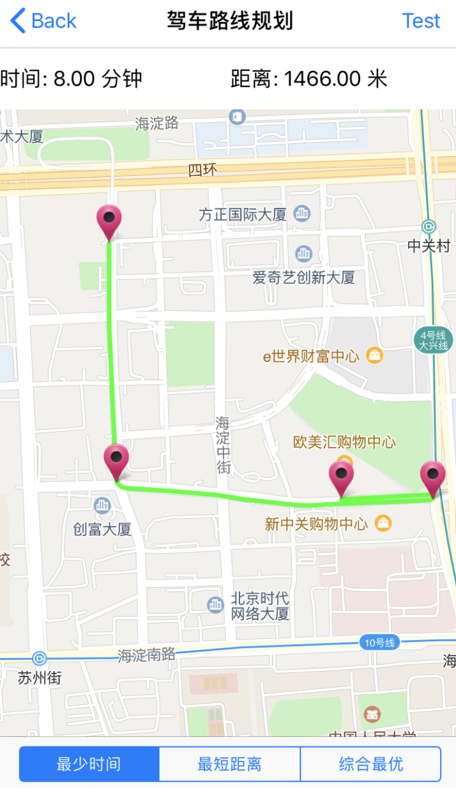

### 错误信息回调

当检索失败时，回调函数 searchWithSearchOption: didFailWithError: 会返回对应的错误信息

```objective-c
- (void)searchWithSearchOption:(QMSSearchOption *)searchOption didFailWithError:(NSError *)error
{
    NSLog(@"%@",error);
}
```

更详细设置请参考demo


## 步行路线规划

### 引入头文件

**引入 QMSSearchKit.h头文件**

```objective-c
#import <QMapKit/QMSSearchKit.h>
```

**在AppDelegate.m 中设置已勾选WebServiceAPI的Key:**

```objective-c
#import <QMapKit/QMSSearchKit.h>

- (BOOL)application:(UIApplication *)application didFinishLaunchingWithOptions:(NSDictionary *)launchOptions {
    
    self.window = [[UIWindow alloc] initWithFrame:[[UIScreen mainScreen] bounds]];
    
    // Configure API Key.
    [QMapServices sharedServices].APIKey = @"您的APIKey";
    
    // 如需检索功能，请设置检索的API Key
    [[QMSSearchServices sharedServices] setApiKey:@"您的APIKey"];
}
```

**注**：请用户确认API Key已勾选WebServiceAPI选项，具体设置请参考[设置](https://lbs.qq.com/webservice_v1/index.html)

**定义QMSSearcherAPI**

定义主搜索对象 QMSSearcherAPI，并继承搜索协议 < QMSSearchDelegate >

**构造QMSSearcherAPI**

构造主搜索对象 QMSSearcherAPI，并设置代理

```objective-c
self.mySearcher = [[QMSSearcher alloc] initWithDelegate: self];
```


### 设置步行路线规划参数

设置 QMSWalkingRouteSearchOption 参数

```objective-c
QMSWalkingRouteSearchOption *walkingOpt = [[QMSWalkingRouteSearchOption alloc] init];
[walkingOpt setFrom:@"39.983906,116.307999"];
[walkingOpt setTo:@"39.979381,116.314128"];
```

其中 from 和 to 是必填字段。

NSString *from 起点坐标 格式：from=lat<纬度>,lng<经度>

NSString *to      终点坐标 格式：to=lat<纬度>,lng<经度>

### 发起步行路线检索

调用QMSSearcherAPI中的 searchWithWalkingRouteSearchOption 发起步行路线检索

```objective-c
[self.mySearcher searchWithWalkingRouteSearchOption:walkingOpt];
```


### 在回调中处理搜索数据

当检索成功后，会调用到 searchWithWalkingRouteSearchOption: didReceiveResult: 回调函数，通过解析QMSWalkingRouteSearchResult 数据把所需的结果绘制到地图上。

```objective-c
- (void)searchWithWalkingRouteSearchOption:(QMSWalkingRouteSearchOption *) walkingRouteSearchOption didRecevieResult:(QMSWalkingRouteSearchResult *) walkingRouteSearchResult
{
    self.walkingRouteResult = walkingRouteSearchResult;
    
    NSLog(@"Result: %@", self.walkingRouteResult);
}
```

QMSWalkingRouteSearchResult类属性说明：

**NSArray *routes**：路径规划方案数组, 元素类型为QMSRoutePlan

获取routes元素的方式请参考demo

**QMSRoutePlan**类（路径规划的路线方案）说明：

**QMSRoutePlan**类（路径规划的路线方案）说明：

|        属性         |                             说明                             |
| :-----------------: | :----------------------------------------------------------: |
|   NSString *mode    |                         方案交通方式                         |
|  CGFloat distance   |                     方案整体距离 单位:米                     |
|  CGFloat duration   |               方案估算时间 单位:分钟 四舍五入                |
| NSString *direction |                       方案整体方向描述                       |
|  NSArray *polyline  | 方案路线坐标点串, 导航方案经过的点, 每个step中会根据索引取得自己所对应的路段,类型为encode的CLLocationCoordinate2D。**具体获取方式可参考demo** |
|   NSArray *steps    |        标记如何通过一个路段的信息，类型为QMSRouteStep        |

QMSRouteStep类的详细属性请参考 QMSSearchResult.h文件。

QMSRouteStep中一重要属性需说明：

​	**NSArray *polyline_idx**：阶段路线坐标点串在方案路线坐标点串的位置，从经纬度数组中 根据索引查询这一段路的途经点。 在WebService原始接口做了除2处理, 数据类型为NSNumber。polyline_idx[0]:起点索引，polyline_idx[1]:终点索引。

获取到的起点索引和终点索引代表着 QMSRoutePlan类中的 NSArray *polyline 相应元素索引的坐标点串值。

具体的使用方式请参考demo


#### 效果示例图

```objective-c
QMSWalkingRouteSearchOption *walkingOpt = [[QMSWalkingRouteSearchOption alloc] init];
[walkingOpt setFrom:@"39.983906,116.307999"];
[walkingOpt setTo:@"39.979381,116.314128"];
[self.mySearcher searchWithWalkingRouteSearchOption:walkingOpt];
```

（数据解析请参考demo）

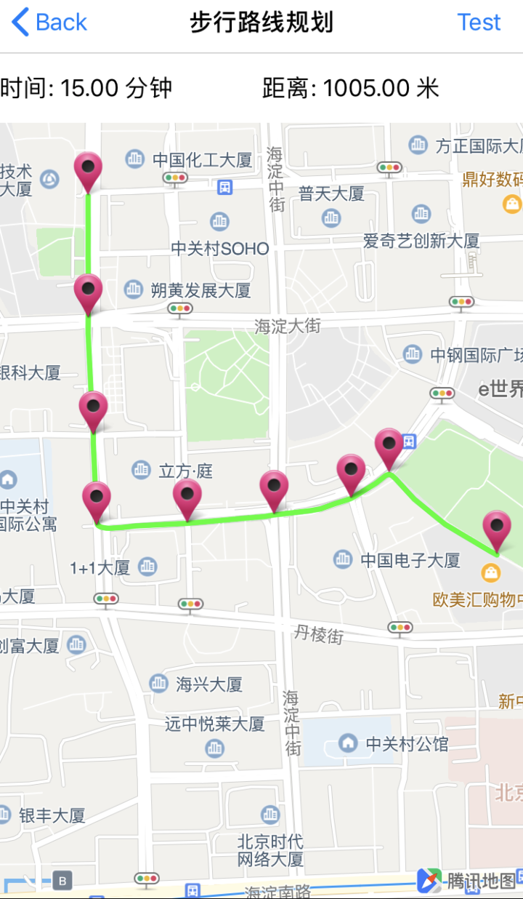

### 错误信息回调

当检索失败时，回调函数 searchWithSearchOption: didFailWithError: 会返回对应的错误信息

```objective-c
- (void)searchWithSearchOption:(QMSSearchOption *)searchOption didFailWithError:(NSError *)error
{
    NSLog(@"%@",error);
}
```

更详细设置请参考demo


## 公交路线规划

### 引入头文件

**引入 QMSSearchKit.h头文件**

```objective-c
#import <QMapKit/QMSSearchKit.h>
```

**在AppDelegate.m 中设置已勾选WebServiceAPI的Key:**

```objective-c
#import <QMapKit/QMSSearchKit.h>

- (BOOL)application:(UIApplication *)application didFinishLaunchingWithOptions:(NSDictionary *)launchOptions {
    
    self.window = [[UIWindow alloc] initWithFrame:[[UIScreen mainScreen] bounds]];
    
    // Configure API Key.
    [QMapServices sharedServices].APIKey = @"您的APIKey";
    
    // 如需检索功能，请设置检索的API Key
    [[QMSSearchServices sharedServices] setApiKey:@"您的APIKey"];
}
```

**注**：请用户确认API Key已勾选WebServiceAPI选项，具体设置请参考[设置](https://lbs.qq.com/webservice_v1/index.html)

**定义QMSSearcherAPI**

定义主搜索对象 QMSSearcherAPI，并继承搜索协议 < QMSSearchDelegate >

**构造QMSSearcherAPI**

构造主搜索对象 QMSSearcherAPI，并设置代理

```objective-c
self.mySearcher = [[QMSSearcher alloc] initWithDelegate: self];
```


### 设置公交路线规划参数

设置 QMSBusingRouteSearchOption 参数

```objective-c
QMSBusingRouteSearchOption *busOpt = [[QMSBusingRouteSearchOption alloc] init];
[busOpt setFrom:@"40.015109,116.313543"];
[busOpt setTo:@"40.151850,116.296881"];
[busOpt setPolicyWithType:QMSBusingRoutePolicyTypeLeastTime];
```

其中 from 和 to 是必填字段。

**NSString *from** 	起点坐标 格式：from=lat<纬度>,lng<经度>

**NSString *to**      	终点坐标 格式：to=lat<纬度>,lng<经度>

**NSString *policy**  路线规划优先条件（非必填） 

​	1) 排序策略，以下三选一：

​     		policy=LEAST_TIME：时间短（默认）

​     		policy=LEAST_TRANSFER：少换乘

​    		 policy=LEAST_WALKING：少步行

​    2) 额外限制条件

​     		可与排序策略配合使用，如：policy=LEAST_TRANSFER,NO_SUBWAY）：NO_SUBWAY ，不坐地铁

**NSDate *departure_time** 	出发时间，用于过滤掉非运营时段的线路，不传时默认使用当前时间(非必填)


### 发起公交路线检索

调用QMSSearcherAPI中的 searchWithBusingRouteSearchOption 发起公交路线检索

```objective-c
 [self.mySearcher searchWithBusingRouteSearchOption:busOpt];
```

### 在回调中处理搜索数据

当检索成功后，会调用到 searchWithBusingRouteSearchOption: didReceiveResult: 回调函数，通过解析QMSBusingRouteSearchResult 数据把所需的结果绘制到地图上。

```objective-c
- (void)searchWithBusingRouteSearchOption:(QMSBusingRouteSearchOption *) busingRouteSearchOption didRecevieResult:(QMSBusingRouteSearchResult *) busingRouteSearchResult
{
    self.busRouteResult = busingRouteSearchResult;
    
  	// 获取第一个路线
    NSLog(@"bus result is: %@", self.busRouteResult.routes[0]);
    
}
```

QMSBusingRouteSearchResult类属性说明：

**NSArray *routes**：路径规划方案数组, 元素类型QMSBusingRoutePlan

可在routes中获取不同的路线

**QMSBusingRoutePlan**类属性说明：

|       属性       |                   说明                    |
| :--------------: | :---------------------------------------: |
| CGFloat distance |               距离 单位:米                |
| CGFloat duration |          时间 单位:分钟 四舍五入          |
| NSString *bounds |      路线bounds，用于显示地图时使用       |
|  NSArray *steps  | 分段描述 类型为:QMSBusingSegmentRoutePlan |

从属性 steps 中可获得公交分段方案（QMSBusingSegmentRoutePlan），解析后的数据可用于在地图上绘制路线。

**QMSBusingSegmentRoutePlan**类属性说明：

|        属性         |                             说明                             |
| :-----------------: | :----------------------------------------------------------: |
|   NSString *mode    | 标记路径规划类型 "DRIVING":驾车 "WALKING":步行 "TRANSIT":公交 |
|  CGFloat distance   |                         距离 单位:米                         |
|  CGFloat duration   |                   时间 单位:分钟 四舍五入                    |
|    CGFloat price    |                   阶段路线所花费用 单位:元                   |
| NSString *direction |                           方向描述                           |
|  NSArray *polyline  | 方案路线坐标点串, 导航方案经过的点, 每个step中会根据索引取得自己所对应的路段,类型为encode的CLLocationCoordinate2D |
|   NSArray *lines    |   同个路段多趟车的选择, 元素类型QMSBusingRouteTransitLine    |

 NSArray *polyline 解析后的数据可以用于绘制分段的polyline，具体获取方式可参考demo

**QMSBusingRouteTransitLine**类说明：

QMSBusingRouteTransitLine 为同个路段多趟车的选择

|                属性                |                             说明                             |
| :--------------------------------: | :----------------------------------------------------------: |
|         NSString *vehicle          |                           交通工具                           |
|           NSString *id_            |                              id                              |
|          CGFloat distance          |                           距离(米)                           |
|      NSTimeInterval duration       |                        预计耗时(分钟)                        |
|          NSString *title           |                             标题                             |
|         NSArray *polyline          | 途经点数组，类型为encode的CLLocationCoordinate2D，具体获取方式可参考demo |
|      NSInteger station_count       |                          经停站数目                          |
| NSArray<QMSBusStation *> *stations |             上车站数组，元素类型为QMSBusStation              |
|  QMSStationEntrance *destination   |                          目的地地址                          |
|        QMSBusStation *geton        |                            上车站                            |
|       QMSBusStation *getoff        |                            下车站                            |

QMSBusStation，QMSStationEntrance等类详情请参考 QMSSearchResult.h 文件。

#### 效果示例图

```objective-c
QMSBusingRouteSearchOption *busOpt = [[QMSBusingRouteSearchOption alloc] init];
[busOpt setFrom:@"40.015109,116.313543"];
[busOpt setTo:@"40.151850,116.296881"];
[busOpt setPolicyWithType:QMSBusingRoutePolicyTypeLeastTime];
[self.mySearcher searchWithBusingRouteSearchOption:busOpt];
```

（数据解析请参考demo）

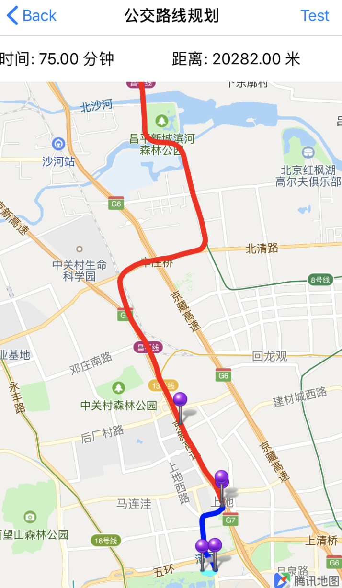

### 错误信息回调

当检索失败时，回调函数 searchWithSearchOption: didFailWithError: 会返回对应的错误信息

```objective-c
- (void)searchWithSearchOption:(QMSSearchOption *)searchOption didFailWithError:(NSError *)error
{
    NSLog(@"%@",error);
}
```

更详细设置请参考demo